# Star Typing — слепая печать + изучение английского «Пульт пилота» 🚀

*Бывший **Stamina**.*

Star Typing — настольная программа на Python (tkinter) в стиле **пульта
космического корабля**. У неё **две цели сразу**:

1. **Слепая печать** — скорость, точность, ритм, миссии по рядам клавиатуры
   (английская QWERTY и русская ЙЦУКЕН), звания и бортжурнал.
2. **Изучение английского** — вы загружаете книгу или статью на английском и
   печатаете её, а панель **UPLINK** показывает перевод **текущего слова**
   (под прицелом, с красной подсветкой нужной буквы) и **всего предложения**.
   Печать и словарь идут одним потоком: пальцы учатся, мозг запоминает слова
   в контексте.

Для печати внешних зависимостей нет: только стандартная библиотека Python 3.10+.
Вкладка **«АНГЛИЙСКИЙ»** работает без интернета; для проверки произношения нужны
`vosk` и `sounddevice` (необязательно, см. «Установка»).

> **Название.** С версии 3.1 программа называется **Star Typing** (раньше — **Stamina**).
> Внутренние имена остались прежними, чтобы не сломать ярлык и не потерять прогресс:
> папка `D:\My_New_Stamina`, точка входа `main.py`, пакет `stamina/`, данные в `%APPDATA%\Stamina`,
> репозиторий `Teslyar75/My_Stamina`.

## Скриншоты

**Фишка: UPLINK — слово под прицелом + перевод предложения**  
Печатаете `coloured` → в окошке слева слово с **красной** буквой, которую
нужно нажать сейчас, справа перевод `цветной`, ниже — перевод всего предложения.
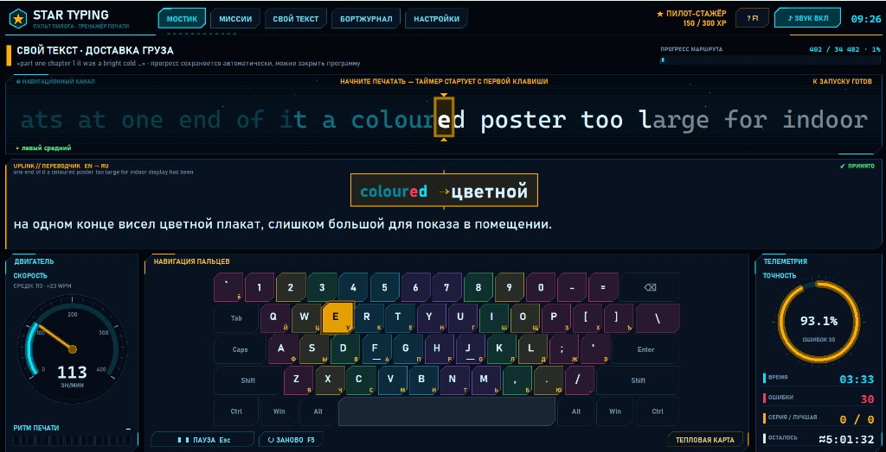

| Звёздная карта миссий | Отчёт о полёте |
| --- | --- |
| 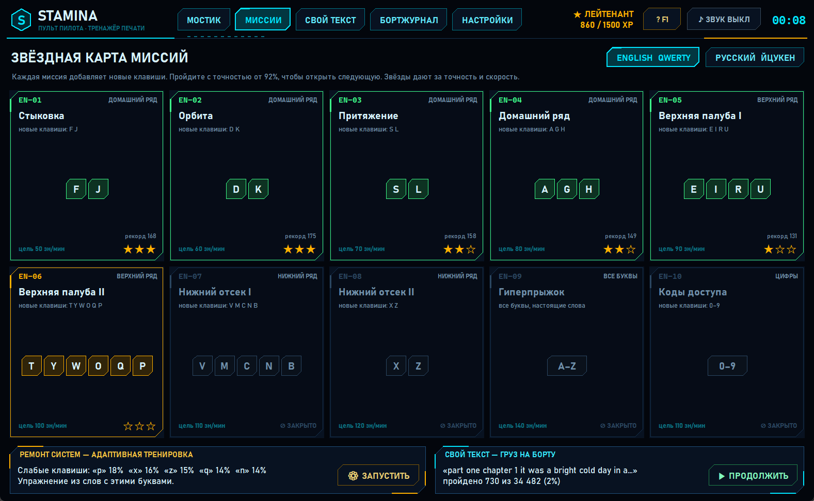 | 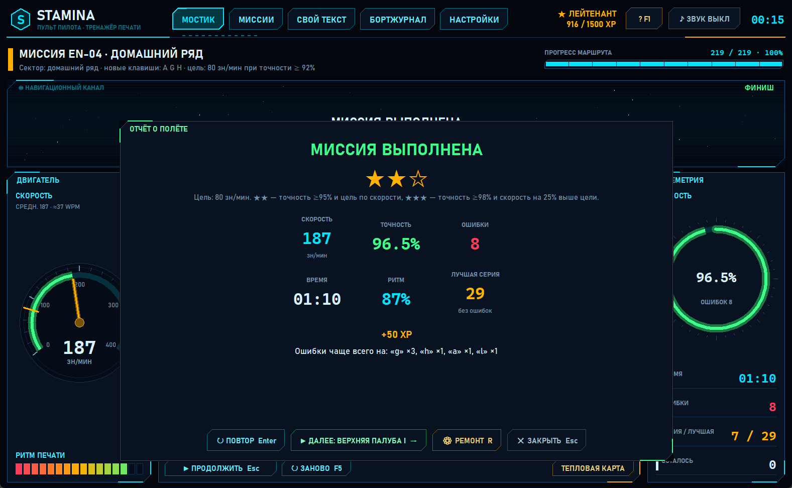 |
| **Бортжурнал: график и тепловая карта** | **Настройки** |
| 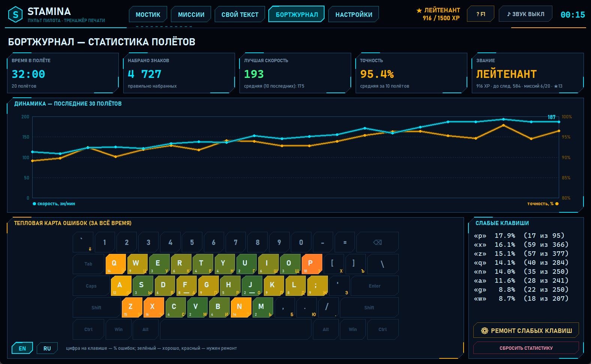 | 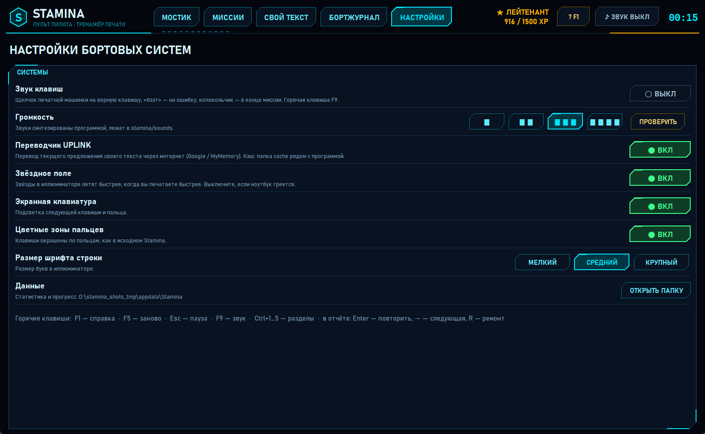 |
| **Свой текст (грузовой отсек)** | **Справка (F1)** |
| 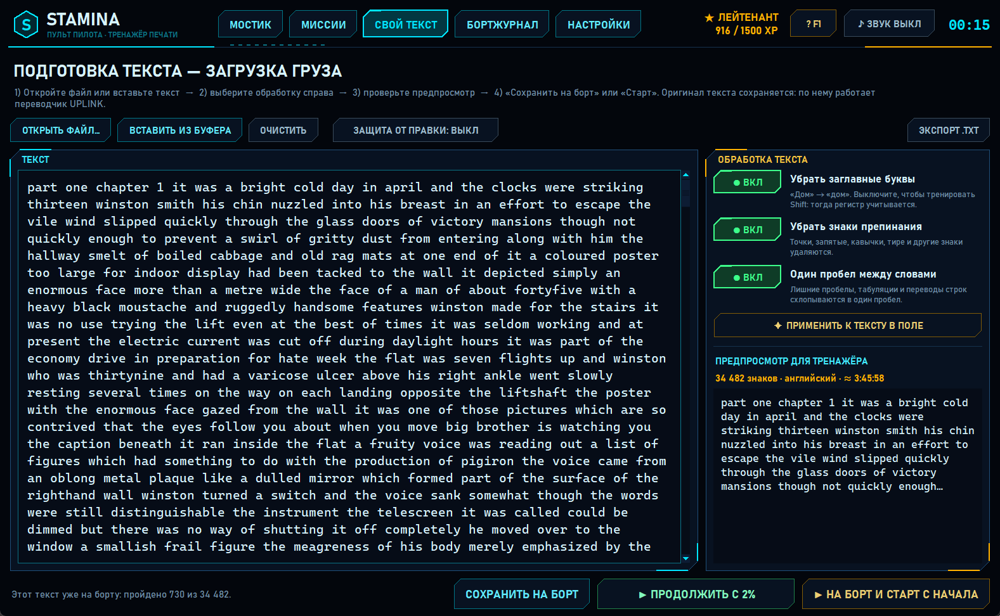 | 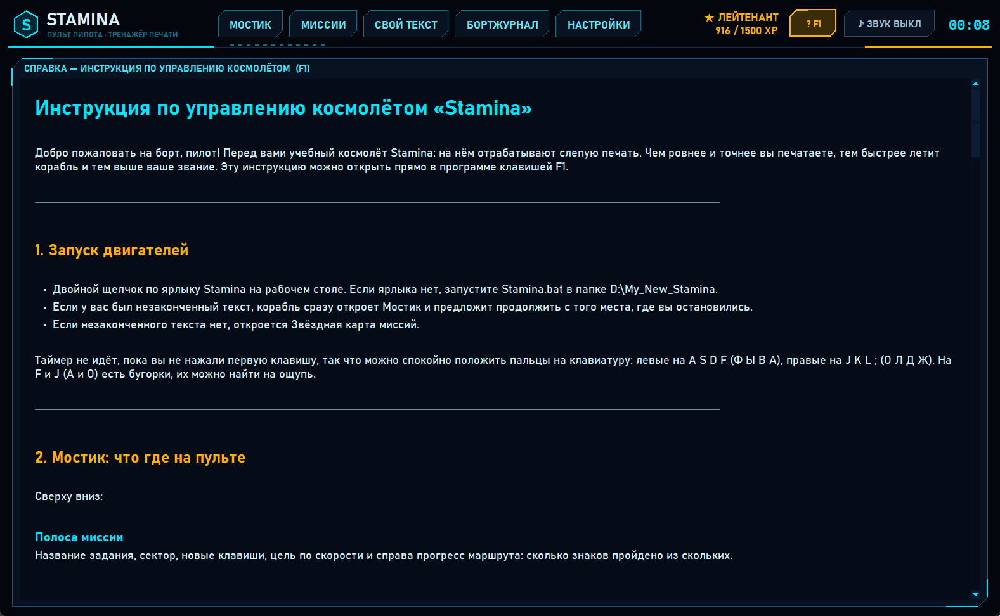 |

Подробная инструкция для пилота: [ИНСТРУКЦИЯ.md](ИНСТРУКЦИЯ.md) (в программе открывается клавишей F1).

Промпты для вайбкодинга (воссоздать проект с нуля или дорастить фичи в Cursor): [VIBE_CODING.md](VIBE_CODING.md).

## Разделы

| Раздел | Клавиши | Что там |
| --- | --- | --- |
| **Мостик** | Ctrl+1 | Тренировка: иллюминатор со строкой набора, спидометр, кольцо точности, ритм, телеметрия, клавиатура, переводчик UPLINK |
| **Миссии** | Ctrl+2 | 10 английских и 10 русских миссий, звёзды, «Ремонт систем», продолжение своего текста |
| **Свой текст** | Ctrl+3 | Подготовка текста: файл или буфер, переключатели «без заглавных / без знаков / один пробел», предпросмотр, сохранить, старт, продолжить |
| **Бортжурнал** | Ctrl+4 | Время в полёте, рекорды, график 30 последних заходов, тепловая карта ошибок, слабые клавиши |
| **Английский** | Ctrl+5 | 20 000 слов по частотности: наборы, карточка слова с переводом и произношением, миссии с микрофоном и «СОВПАДЕНИЕ %», флеш-карточки SM-2, свои списки |
| **Настройки** | Ctrl+6 | Звук и громкость, переводчик, звёзды, клавиатура, зоны пальцев, размер шрифта |

### Мостик
- **Иллюминатор** — текст «проезжает» через неподвижный прицел в центре (идея исходного
  Stamina). Набранное уходит влево и тускнеет, текущая буква в янтарной рамке.
  Ошибка — красная вспышка и подсказка «нажато «ы» — нужно «s»»; если перепутана
  раскладка, программа подскажет переключить её.
- **Звёзды** летят быстрее, когда вы печатаете быстрее (можно выключить).
- **Двигатель** — спидометр: живая скорость в знаках в минуту, средняя скорость и WPM
  (слов в минуту), янтарная отметка — цель миссии.
- **Телеметрия** — точность, время, ошибки, серия без ошибок, сколько осталось.
- **Ритм печати** — насколько ровно вы печатаете (100 % — как метроном).
- **Навигация пальцев** — клавиатура с подписями EN и RU, цветные зоны пальцев,
  следующая клавиша подсвечена, внизу иллюминатора подсказка, каким пальцем жать.
  Кнопка «Тепловая карта» показывает процент ошибок на каждой клавише.
- **UPLINK // ПЕРЕВОДЧИК** (только для своего текста) — см. отдельный раздел ниже.

### В чём фишка: печать + английский (UPLINK)

Панель UPLINK под иллюминатором — это и есть «учебный канал»:

| Элемент | Что показывает |
| --- | --- |
| Строка сверху | исходное английское предложение |
| **Окошко по центру (под прицелом)** | набираемое **слово**: слева оригинал, справа перевод; **красная** буква — та, которую нужно нажать сейчас; уже набранные буквы слова приглушены |
| Строка под окошком | перевод **всего предложения** крупным шрифтом |

Так вы не отрываетесь от набора: слово запоминается в момент печати, а предложение
даёт контекст. Для русского «груза» направление перевода обратное (RU → EN).
Переводчик работает в фоне, кэширует ответы и не тормозит печать.

### Время считается честно
Таймер стартует с первой нажатой клавиши. Если вы отошли и не печатали больше 4 секунд,
это время не засчитывается. **Esc** — пауза (Esc или Пробел — продолжить). Если окно
теряет фокус или вы уходите в другой раздел, полёт ставится на паузу сам.

### Миссии и звания
Каждая миссия добавляет новые клавиши: домашний ряд → верхний ряд → нижний ряд →
все буквы → цифры. Миссия засчитана при точности от 92 %:
★ — засчитано, ★★ — точность ≥ 95 % и скорость не ниже цели,
★★★ — точность ≥ 98 % и скорость на 25 % выше цели. Пройденная миссия открывает следующую.
За каждый заход начисляется опыт (XP), звания: Кадет → Пилот-стажёр → Мичман →
Лейтенант → Капитан-лейтенант → Капитан → Коммодор → Адмирал флота.

**Ремонт систем** — программа запоминает ошибки по каждой клавише и собирает упражнение
из слов, в которых много ваших «слабых» букв.

### Свой текст: главная функция Star Typing
Раздел **«Свой текст»** (Ctrl+3), панель «Подготовка текста — загрузка груза»:
1. **Открыть файл…** (`.txt`, UTF-8 или Windows-1251) или **Вставить из буфера**.
2. Справа, в панели **«Обработка текста»**, три независимых переключателя (по умолчанию включены все):
   - **Убрать заглавные буквы.** Если выключить, регистр учитывается, и вы тренируете Shift;
   - **Убрать знаки препинания.** Если выключить, знаки остаются, а типографские
     « » — … заменяются на обычные " - ..., чтобы их можно было набрать;
   - **Один пробел между словами.** Лишние пробелы, табуляции и переводы строк схлопываются.
3. **✦ Применить к тексту в поле** — выбранная обработка применяется прямо к тексту в редакторе
   (как «Применить все правки» в прежней версии).
4. **Предпросмотр для тренажёра**: что именно попадёт в строку набора, сколько знаков, язык и
   сколько времени займёт текст при вашей скорости.
5. **Сохранить на борт** (текст готов, старт с первой клавиши на Мостике), **На борт и старт с
   начала** или **Продолжить с …%**.
6. Ещё есть **Очистить**, **Защита от правки** (поле только для чтения) и **Экспорт .txt**
   (сохранить подготовленный текст в файл).

Оригинал текста сохраняется: по нему переводчик понимает, где кончается предложение.
Прогресс сохраняется автоматически, программу можно закрыть в любой момент и
потом нажать «Продолжить». Незаконченный текст из версии 2 (например, «1984»)
продолжается с того же места. Если заново открыть тот же файл, можно продолжить с того же
места, и переводчик начнёт работать по предложениям.

### Звук
- верная клавиша — щелчок печатной машинки;
- ошибка — глухой «бззт»;
- миссия выполнена — колокольчик каретки.

Звуки синтезирует сама программа (`stamina/sounds.py`), файлы лежат в `stamina/sounds/`.
Включить или выключить звук: F9 или кнопка «ЗВУК» вверху. Громкость меняется в настройках.

### Переводчик UPLINK (технически)
- Переводит **слово** и **предложение** отдельно (оба запроса кэшируются).
- Перевод идёт в фоне, печать никогда не тормозит.
- Сначала бесплатный Google Translate (без ключа), запасной вариант — MyMemory.
- Кэш: `cache/translations.json` рядом с программой — повторные фразы работают офлайн.
- Нет сети — на панели «НЕТ СВЯЗИ», повтор раз в 20 секунд.
- Выключается в настройках.

## Вкладка «АНГЛИЙСКИЙ» (версия 3.2)

Тренажёр английских слов прямо на борту — в том же стиле пульта, с теми же званиями и XP.
Работает без интернета, без регистрации и без платных сервисов.

- **20 000 слов** по частотности, четыре набора: Essential 1000, Core 3000, Advanced 10 000, Master 20 000.
- **Карточка слова (СКАНЕР):** определение, IPA, слоги и ударение, подсказки по трудным звукам,
  русский перевод (поле «МОЙ ПЕРЕВОД» заполнено заранее, свой вариант главнее), примеры
  предложений с переводом, озвучка обычной и медленной скоростью (голос Windows).
- **Проверка произношения:** читаете предложение в микрофон, распознавание Vosk без интернета
  показывает «СОВПАДЕНИЕ: 86%» и подсвечивает пропущенные слова. Индикатор «● СЛУШАЮ…» с живой
  шкалой громкости, затем «РАСПОЗНАЮ…». Без микрофона — самооценка.
- **Миссии** (говорение, чтение, вопросы), **флеш-карточки** с интервальным повторением SM-2,
  **отсеки** (свои списки, экспорт CSV, импорт из .txt), **журнал** со знаками отличия.
- F1 на вкладке открывает главу «12. АНГЛИЙСКИЙ» в [инструкции](ИНСТРУКЦИЯ.md).

| Обзор | Звёздные карты (плитки с переводом) |
| --- | --- |
| 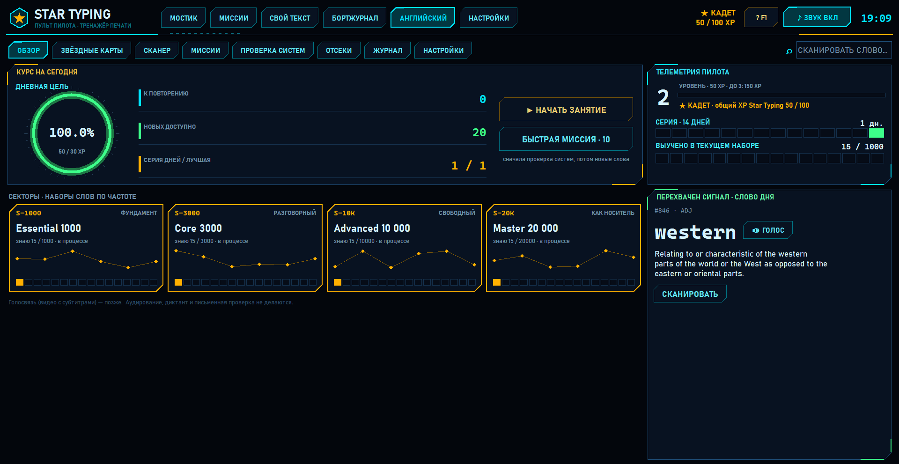 | 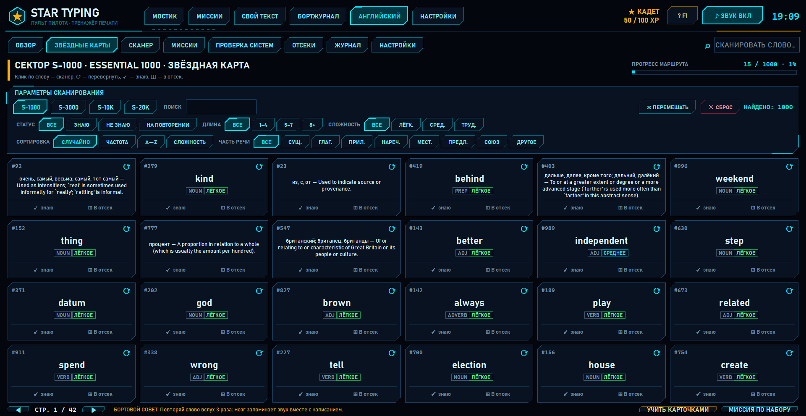 |
| **Сканер: перевод и «СОВПАДЕНИЕ %»** | **Миссии** |
| 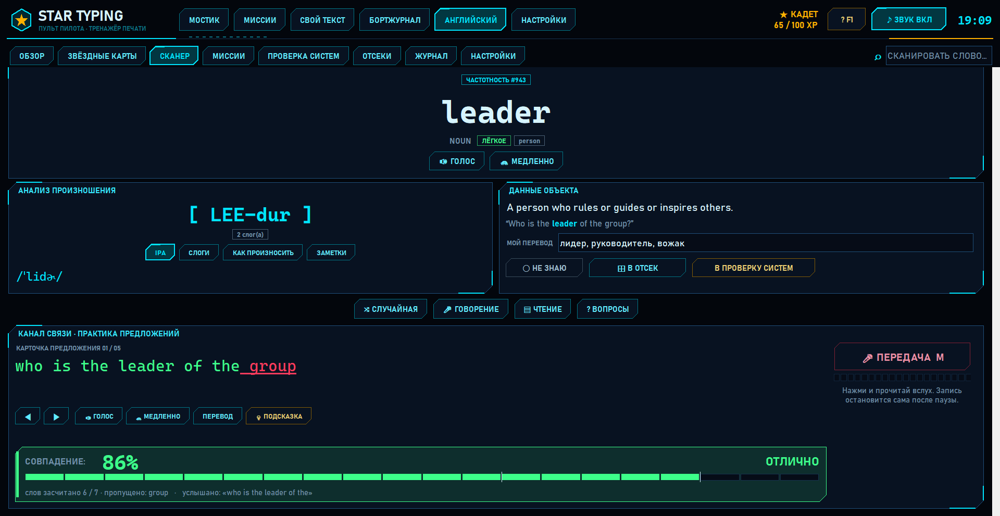 | 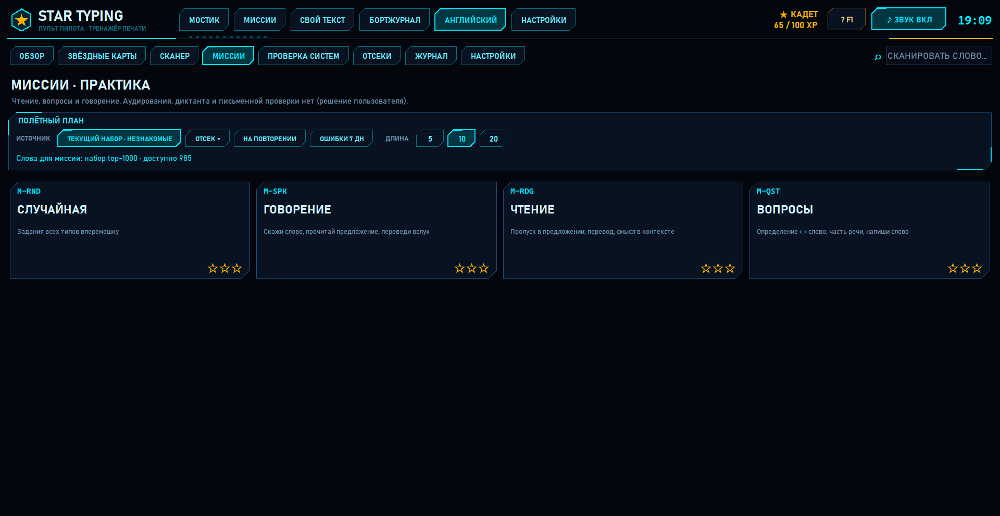 |
| **Проверка систем (карточки)** | **Отсеки** |
| 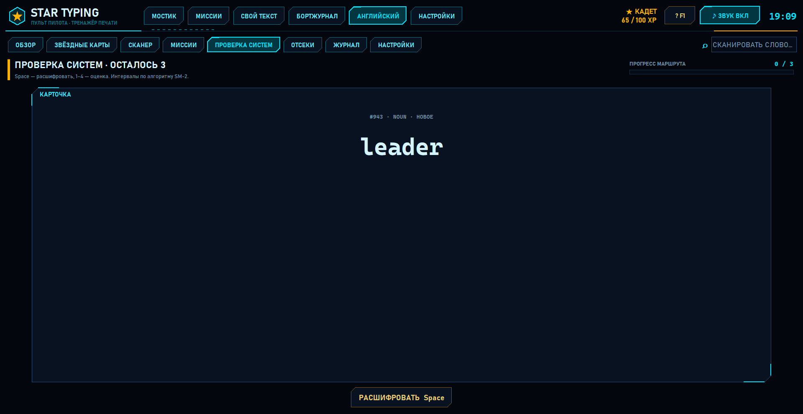 | 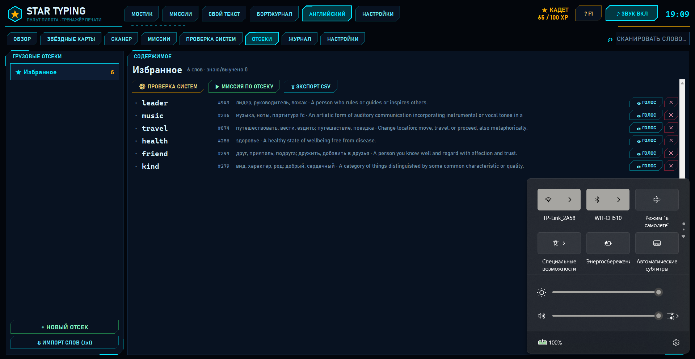 |
| **Журнал** | **Настройки** |
| 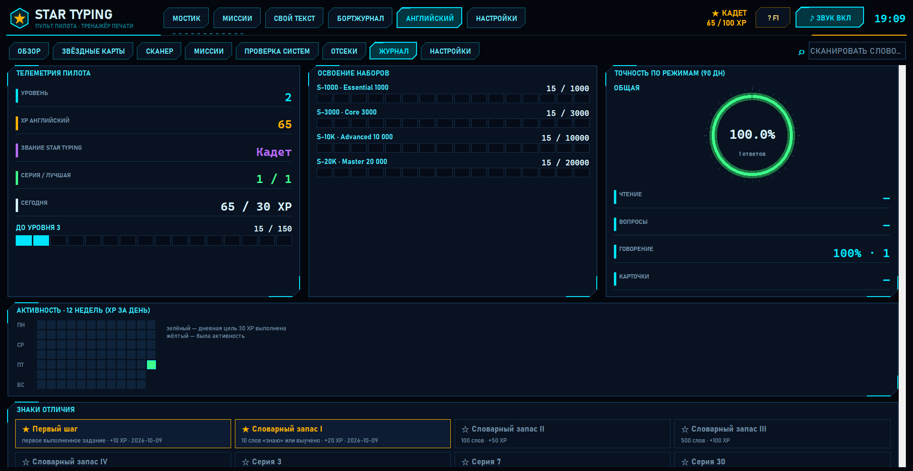 | 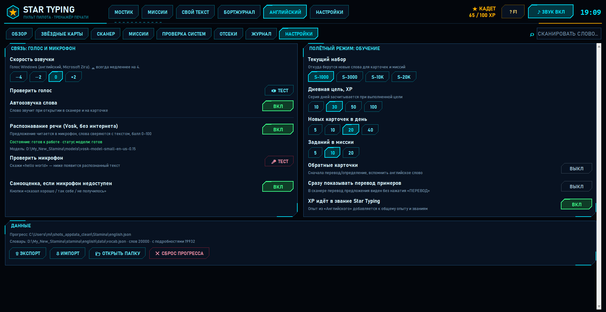 |

### Наборы слов: объём и примеры

Посчитано по `stamina/english/data/vocab.json`. Наборы вложены: Core 3000 включает Essential 1000 и т. д.

| Набор | Слов всего | Новых в наборе | Примеров (новые слова) | из них с переводом | Примеров всего (накопительно) | ≈ уровень CEFR |
| --- | ---: | ---: | ---: | ---: | ---: | --- |
| Essential 1000 | 1 000 | 1 000 | 4 983 | 4 983 | 4 983 | A1–A2 |
| Core 3000 | 3 000 | 2 000 | 9 610 | 9 610 | 14 593 | B1 |
| Advanced 10 000 | 10 000 | 7 000 | 24 138 | 24 138 | 38 731 | B2–C1 |
| Master 20 000 | 20 000 | 10 000 | 15 236 | 15 233 | 53 967 | C2 / почти как носитель (пассивно) |
| **Итого** | **20 000** | **20 000** | **53 967** | **53 964** | **53 967** | |

Хотя бы один пример есть у 19 935 слов из 20 000. Соответствие CEFR примерное: это часто приводимые оценки по объёму словаря, а уровень зависит не только от количества слов (ещё грамматика, аудирование, речь, письмо).

Словарь (`stamina/english/data/vocab.json`) собран нашими скриптами только из открытых
источников — список и лицензии ниже, подробности в [docs/ENGLISH_DATA.md](docs/ENGLISH_DATA.md), скрипты сборки — в [tools/vocab_builder/](tools/vocab_builder/).
Устройство вкладки: [docs/ENGLISH_TAB.md](docs/ENGLISH_TAB.md), стиль: [docs/ENGLISH_DESIGN.md](docs/ENGLISH_DESIGN.md).

## Горячие клавиши
| Клавиша | Действие |
| --- | --- |
| F1 | справка (инструкция) |
| Esc | пауза / продолжить |
| F5 | начать заново |
| F9 | звук вкл/выкл |
| Ctrl+1…6 | разделы (Ctrl+5 — Английский, Ctrl+6 — Настройки) |
| В отчёте: Enter / → / R / Esc | повторить / следующая миссия / ремонт / закрыть |

## Где хранятся данные
`%APPDATA%\Stamina\` (на Linux `~/.stamina`). Папка называется по-старому, «Stamina»: так
прогресс из прежних версий подхватывается без переноса.

| Файл | Что внутри |
| --- | --- |
| `session.json` | незаконченный свой текст и место, где вы остановились (формат как в версии 2) |
| `stats.json` | история заходов, ошибки по клавишам, звёзды миссий, опыт |
| `settings.json` | настройки и размер окна |
| `cargo.txt`, `cargo_original.txt` | свой текст: адаптированный и оригинал |
| `english.json` | прогресс вкладки «АНГЛИЙСКИЙ»: карточки, свои переводы, отсеки, XP |

Личные данные в репозиторий не попадают: они лежат вне папки программы, а `.gitignore`
дополнительно исключает `session.json`, `stats.json`, `settings.json`, `english.json`, логи,
`cache/` и `models/`.

Кэш переводов: `cache\translations.json` в папке программы.

## Установка и запуск
```powershell
git clone https://github.com/Teslyar75/My_Stamina.git
cd My_Stamina
python main.py
```
Проверка произношения во вкладке «АНГЛИЙСКИЙ» (необязательно; модель Vosk ~40 МБ в git не хранится):
```powershell
pip install vosk sounddevice
python scripts/download_vosk_model.py   # скачает модель в models/
```
- `Stamina.bat` — запуск двойным кликом без чёрного окна;
- `create_shortcut.ps1` — создаёт ярлык «Star Typing» на рабочем столе со значком-звездой
  (старый ярлык «Stamina» удаляется).

## Тесты
```powershell
python -m unittest discover -s tests -v
```

## Структура проекта
```
main.py                 точка входа (её запускает ярлык)
Stamina.bat             запуск двойным кликом без консоли
create_shortcut.ps1     создание ярлыка на рабочем столе
ИНСТРУКЦИЯ.md           инструкция пилота (открывается в программе по F1)
CHANGELOG.md            история изменений
CURSOR_TASK.md          описание задачи и статус для Cursor
VIBE_CODING.md          набор промптов для вайбкодинга проекта
screenshots/            скриншоты для README
stamina/                пакет программы (имя прежнее, чтобы не ломать запуск)
  app.py                запуск, чёткий текст на экранах 125–150 %, своя иконка на панели задач
  assets/               иконка Star Typing (star_typing.ico, star_typing_64.png)
  cockpit.py            главное окно: верхняя панель, разделы, горячие клавиши
  bridge.py             «Мостик»: тренировка, приборы, отчёт, переводчик
  screens.py            «Миссии», «Свой текст», «Бортжурнал», «Настройки», «Справка»
  hud.py                виджеты HUD: кнопки, панели, спидометр, кольцо, иллюминатор, клавиатура, график
  engine.py             логика набора: скорость, точность, ритм, честное время
  missions.py           миссии, генерация упражнений, ремонт слабых клавиш, звания
  layouts.py            клавиатура EN/RU и зоны пальцев
  sounds.py, sounds/    синтез и проигрывание звуков
  translator.py         UPLINK: разбиение на предложения, перевод в фоне, кэш
  storage.py            настройки, статистика, свой текст
  session_storage.py    сохранение незаконченного текста (session.json)
  text_processing.py    адаптация текста
  theme.py              цвета, шрифты, масштаб
  english_hook.py       подключение вкладки «АНГЛИЙСКИЙ»
  english/              вкладка «АНГЛИЙСКИЙ»: экраны, словарь, прогресс, озвучка, распознавание речи
    data/vocab.json     словарь 20 000 слов (открытые источники, CC BY-SA 4.0)
docs/                   ENGLISH_TAB.md, ENGLISH_DESIGN.md, ENGLISH_DATA.md
scripts/                download_vosk_model.py / .ps1 — скачать модель распознавания речи
tools/vocab_builder/    скрипты сборки словаря из открытых источников (для приложения не нужны)
models/                 (не в git) модель Vosk
tests/                  тесты адаптации, логики набора, миссий и переводчика
```

## Благодарности / Идея

Идею модуля английского подсказал **Богдан Стащук (Bogdan Stashchuk)** — автор
[YouTube-канала](https://www.youtube.com/@Bogdan_Stashchuk) и
[курсов по программированию на Udemy](https://www.udemy.com/user/bogdanstashchuk/), а также
проекта [bsmarted.com](https://bsmarted.com/). Спасибо за вдохновение!

Реализация, дизайн, код и данные здесь — наши собственные: словарь собран из открытых
источников (ниже), никакие материалы bsmarted.com не используются. Программ такого рода много;
эта — личный вариант, встроенный в тренажёр печати Star Typing.

## Источники данных и лицензии

| Что | Источник | Лицензия |
| --- | --- | --- |
| Частотный список слов, ранги | [wordfreq](https://github.com/rspeer/wordfreq) | данные CC BY-SA 4.0, код Apache 2.0 |
| Переводы на русский, части речи, IPA, переносы | [Wiktionary](https://www.wiktionary.org/) (дамп [kaikki.org](https://kaikki.org/)) | CC BY-SA 4.0 |
| Определения, части речи, темы | [WordNet 3.0](https://wordnet.princeton.edu/) | WordNet License (Princeton) |
| Произношение | [CMUdict](https://github.com/cmusphinx/cmudict) | BSD-2-Clause |
| Примеры предложений EN–RU | [Tatoeba](https://tatoeba.org/) | CC BY 2.0 FR |
| Частоты русских слов (выбор перевода) | [FrequencyWords](https://github.com/hermitdave/FrequencyWords) | CC BY-SA 4.0 |
| Машинный перевод части слов и сгенерированных примеров | [Helsinki-NLP opus-mt-en-ru](https://huggingface.co/Helsinki-NLP/opus-mt-en-ru) | Apache 2.0 |
| Генерация простых примеров (где нет Tatoeba) | [Qwen2.5-1.5B-Instruct](https://huggingface.co/Qwen/Qwen2.5-1.5B-Instruct) | Apache 2.0 |
| Распознавание речи (скачивается отдельно) | [Vosk](https://alphacephei.com/vosk/models) `vosk-model-small-en-us-0.15` | Apache 2.0 |

Файл словаря `stamina/english/data/vocab.json` распространяется на условиях **CC BY-SA 4.0**
(из-за данных Викисловаря и wordfreq). Предложения Tatoeba — CC BY 2.0 FR, номер предложения
хранится в поле `tatoeba_id` (страница `https://tatoeba.org/sentences/show/<id>`).

## История изменений
Что нового в версии 3.0 «Пульт пилота», что удалено и почему, смотрите в [CHANGELOG.md](CHANGELOG.md).
