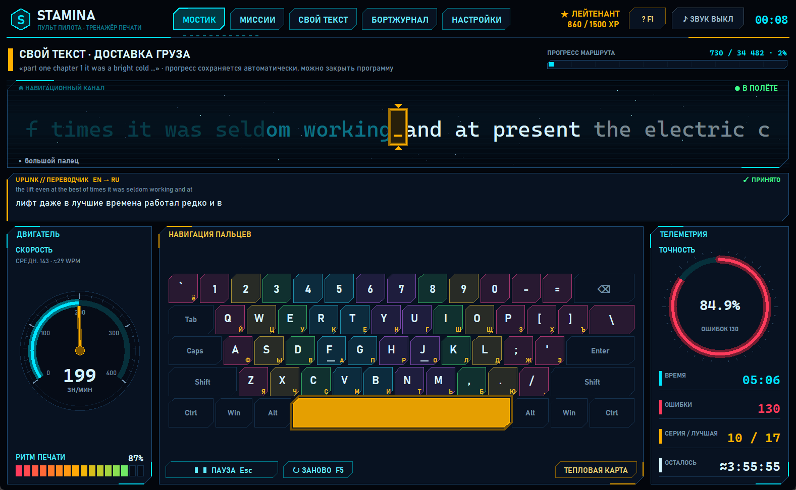

# Stamina — тренажёр слепой печати «Пульт пилота» 🚀

Stamina — настольный тренажёр слепой печати на Python (tkinter) в стиле
**пульта космического корабля**: тёмный космос, неоновые приборы, звёзды в
«иллюминаторе», миссии и звания. Можно проходить уроки-миссии по рядам
клавиатуры (английская QWERTY и русская ЙЦУКЕН) или печатать **свой текст**
(книгу, статью) с переводом текущего предложения через интернет.

Внешних зависимостей нет: только стандартная библиотека Python 3.10+.

## Скриншоты

**Мостик: печать своего текста с переводчиком UPLINK**


| Звёздная карта миссий | Отчёт о полёте |
| --- | --- |
|  |  |
| **Бортжурнал: график и тепловая карта** | **Настройки** |
|  |  |
| **Свой текст (грузовой отсек)** | **Справка (F1)** |
|  |  |

Подробная инструкция для пилота: [ИНСТРУКЦИЯ.md](ИНСТРУКЦИЯ.md) (в программе открывается клавишей F1).

## Разделы

| Раздел | Клавиши | Что там |
| --- | --- | --- |
| **Мостик** | Ctrl+1 | Тренировка: иллюминатор со строкой набора, спидометр, кольцо точности, ритм, телеметрия, клавиатура, переводчик UPLINK |
| **Миссии** | Ctrl+2 | 10 английских и 10 русских миссий, звёзды, «Ремонт систем», продолжение своего текста |
| **Свой текст** | Ctrl+3 | Грузовой отсек: открыть файл, вставить из буфера, адаптировать, экспорт, старт / продолжить |
| **Бортжурнал** | Ctrl+4 | Время в полёте, рекорды, график 30 последних заходов, тепловая карта ошибок, слабые клавиши |
| **Настройки** | Ctrl+5 | Звук и громкость, переводчик, звёзды, клавиатура, зоны пальцев, размер шрифта |

### Мостик
- **Иллюминатор** — текст «проезжает» через неподвижный прицел в центре (идея исходного
  Stamina). Набранное уходит влево и тускнеет, текущая буква в янтарной рамке.
  Ошибка — красная вспышка и подсказка «нажато «ы» — нужно «s»»; если перепутана
  раскладка, программа подскажет переключить её.
- **Звёзды** летят быстрее, когда вы печатаете быстрее (можно выключить).
- **Двигатель** — спидометр: живая скорость в знаках в минуту, средняя скорость и WPM
  (слов в минуту), янтарная отметка — цель миссии.
- **Телеметрия** — точность, время, ошибки, серия без ошибок, сколько осталось.
- **Ритм печати** — насколько ровно вы печатаете (100 % — как метроном).
- **Навигация пальцев** — клавиатура с подписями EN и RU, цветные зоны пальцев,
  следующая клавиша подсвечена, внизу иллюминатора подсказка, каким пальцем жать.
  Кнопка «Тепловая карта» показывает процент ошибок на каждой клавише.
- **UPLINK // ПЕРЕВОДЧИК** (только для своего текста) — перевод текущего предложения
  (английский → русский, для русского текста наоборот).

### Время считается честно
Таймер стартует с первой нажатой клавиши. Если вы отошли и не печатали больше 4 секунд,
это время не засчитывается. **Esc** — пауза (Esc или Пробел — продолжить). Если окно
теряет фокус или вы уходите в другой раздел, полёт ставится на паузу сам.

### Миссии и звания
Каждая миссия добавляет новые клавиши: домашний ряд → верхний ряд → нижний ряд →
все буквы → цифры. Миссия засчитана при точности от 92 %:
★ — засчитано, ★★ — точность ≥ 95 % и скорость не ниже цели,
★★★ — точность ≥ 98 % и скорость на 25 % выше цели. Пройденная миссия открывает следующую.
За каждый заход начисляется опыт (XP), звания: Кадет → Пилот-стажёр → Мичман →
Лейтенант → Капитан-лейтенант → Капитан → Коммодор → Адмирал флота.

**Ремонт систем** — программа запоминает ошибки по каждой клавише и собирает упражнение
из слов, в которых много ваших «слабых» букв.

### Свой текст
Откройте `.txt` (UTF-8 или Windows-1251) или вставьте текст из буфера. Для тренажёра он
адаптируется: без знаков препинания, строчными буквами, один пробел между словами.
Оригинал сохраняется: по нему переводчик понимает, где кончается предложение.
Прогресс сохраняется автоматически, программу можно закрыть в любой момент и
потом нажать «Продолжить». Если заново открыть тот же файл, можно продолжить с того же
места, и переводчик начнёт работать по предложениям.

### Звук
- верная клавиша — щелчок печатной машинки;
- ошибка — глухой «бззт»;
- миссия выполнена — колокольчик каретки.

Звуки синтезирует сама программа (`stamina/sounds.py`), файлы лежат в `stamina/sounds/`.
Включить или выключить звук: F9 или кнопка «ЗВУК» вверху. Громкость меняется в настройках.

### Переводчик UPLINK
- Перевод идёт в фоне, печать никогда не тормозит.
- Сначала бесплатный Google Translate (без ключа), запасной вариант — MyMemory.
- Все переводы сохраняются в `cache/translations.json` рядом с программой, поэтому уже
  встречавшиеся предложения переводятся и без интернета.
- Нет сети — на панели «НЕТ СВЯЗИ», программа сама пробует снова раз в 20 секунд.
- Выключается в настройках.

## Горячие клавиши
| Клавиша | Действие |
| --- | --- |
| F1 | справка (инструкция) |
| Esc | пауза / продолжить |
| F5 | начать заново |
| F9 | звук вкл/выкл |
| Ctrl+1…5 | разделы |
| В отчёте: Enter / → / R / Esc | повторить / следующая миссия / ремонт / закрыть |

## Где хранятся данные
`%APPDATA%\Stamina\` (на Linux `~/.stamina`):

| Файл | Что внутри |
| --- | --- |
| `session.json` | незаконченный свой текст и место, где вы остановились (формат как в версии 2) |
| `stats.json` | история заходов, ошибки по клавишам, звёзды миссий, опыт |
| `settings.json` | настройки и размер окна |
| `cargo.txt`, `cargo_original.txt` | свой текст: адаптированный и оригинал |

Кэш переводов: `cache\translations.json` в папке программы.

## Установка и запуск
```powershell
git clone https://github.com/Teslyar75/My_Stamina.git
cd My_Stamina
python main.py
```
- `Stamina.bat` — запуск двойным кликом без чёрного окна;
- `create_shortcut.ps1` — создаёт ярлык на рабочем столе.

## Тесты
```powershell
python -m unittest discover -s tests -v
```

## Структура проекта
```
main.py                 точка входа (её запускает ярлык)
Stamina.bat             запуск двойным кликом без консоли
create_shortcut.ps1     создание ярлыка на рабочем столе
ИНСТРУКЦИЯ.md           инструкция пилота (открывается в программе по F1)
CHANGELOG.md            история изменений
CURSOR_TASK.md          описание задачи и статус для Cursor
screenshots/            скриншоты для README
stamina/
  app.py                запуск, чёткий текст на экранах 125–150 %
  cockpit.py            главное окно: верхняя панель, разделы, горячие клавиши
  bridge.py             «Мостик»: тренировка, приборы, отчёт, переводчик
  screens.py            «Миссии», «Свой текст», «Бортжурнал», «Настройки», «Справка»
  hud.py                виджеты HUD: кнопки, панели, спидометр, кольцо, иллюминатор, клавиатура, график
  engine.py             логика набора: скорость, точность, ритм, честное время
  missions.py           миссии, генерация упражнений, ремонт слабых клавиш, звания
  layouts.py            клавиатура EN/RU и зоны пальцев
  sounds.py, sounds/    синтез и проигрывание звуков
  translator.py         UPLINK: разбиение на предложения, перевод в фоне, кэш
  storage.py            настройки, статистика, свой текст
  session_storage.py    сохранение незаконченного текста (session.json)
  text_processing.py    адаптация текста
  theme.py              цвета, шрифты, масштаб
tests/                  тесты адаптации, логики набора, миссий и переводчика
```

## История изменений
Что нового в версии 3.0 «Пульт пилота», что удалено и почему, смотрите в [CHANGELOG.md](CHANGELOG.md).
