# Star Typing — слепая печать + английский + скорочтение «Пульт пилота» 🚀

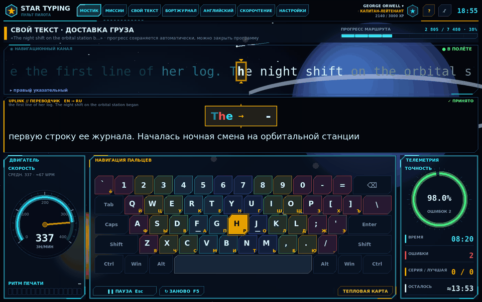

*«Живой космос» (3.5): [полное видео MP4](docs/living_space/living_space.mp4) · подробнее — [ниже](#живой-космос-версия-35).*

## 🚀 Быстрый старт для новичка

**Ваша система:** [🪟 Windows](#windows--один-двойной-щелчок) · [🐧 Linux (Ubuntu и др.)](#linux-ubuntu--одна-команда)

### Windows — один двойной щелчок
1. Скачайте программу: зелёная кнопка **Code → Download ZIP**
   ([прямая ссылка](https://github.com/Teslyar75/My_Stamina/archive/refs/heads/master.zip)) и распакуйте,
   например, в `C:\StarTyping`. (Или `git clone https://github.com/Teslyar75/My_Stamina.git`.)
2. Дважды щёлкните **`install.bat`**. Он сделает всё сам:
   - нет Python — поставит Python 3.12 через `winget` (если winget нет, откроет python.org: при установке
     поставьте галочку **«Add python.exe to PATH»** и запустите `install.bat` ещё раз);
   - создаст папку `.venv`, поставит Pillow; спросит один раз (20 с, по умолчанию «нет») про проверку
     произношения (vosk + модель ~40 МБ);
   - создаст ярлык **«Star Typing»** на рабочем столе (это `create_shortcut.ps1`; вручную:
     `powershell -ExecutionPolicy Bypass -File create_shortcut.ps1`) и запустит программу.
3. Дальше — ярлык на рабочем столе или `Stamina.bat`. Если запустить `Stamina.bat` раньше `install.bat`,
   он сам предложит установку.

### Linux (Ubuntu) — одна команда
1. Скачайте и распакуйте ZIP (как выше) или `git clone https://github.com/Teslyar75/My_Stamina.git`.
2. В папке программы выполните:
   ```bash
   bash install.sh
   ```
   Скрипт спросит пароль sudo и поставит всё: `python3 python3-tk python3-venv python3-pip libportaudio2
   espeak-ng alsa-utils` (apt; есть варианты для dnf, pacman, zypper), папку `.venv` с Pillow, vosk и
   sounddevice, модель речи, ярлык в меню (`~/.local/share/applications/star-typing.desktop`) и на рабочем
   столе — и запустит программу. Потом запуск: ярлык или `./run.sh`. Без проверки произношения:
   `bash install.sh --no-voice`.

   Совсем без ZIP, одной строкой (скачает в `~/StarTyping`):
   ```bash
   curl -fsSL https://raw.githubusercontent.com/Teslyar75/My_Stamina/master/install.sh | bash
   ```

### Что вы увидите
| 1. Добро пожаловать на борт | 2. Создание пилота | 3. Мостик: первая миссия |
|---|---|---|
| 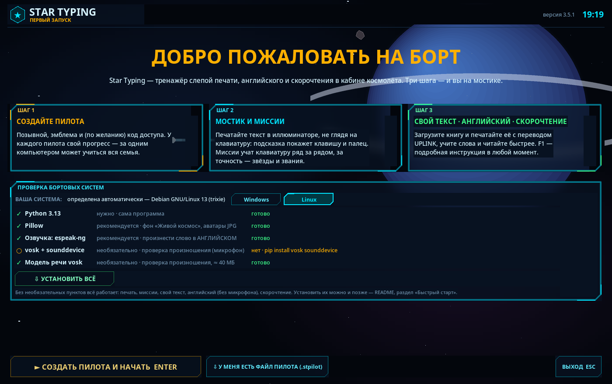 | 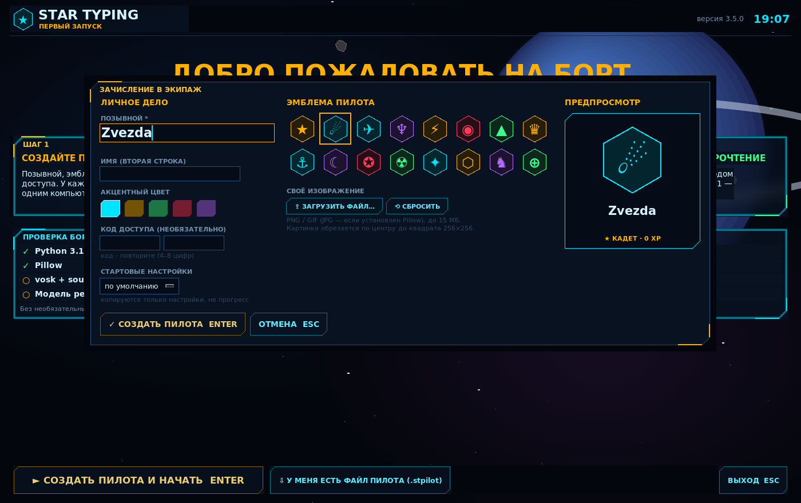 | 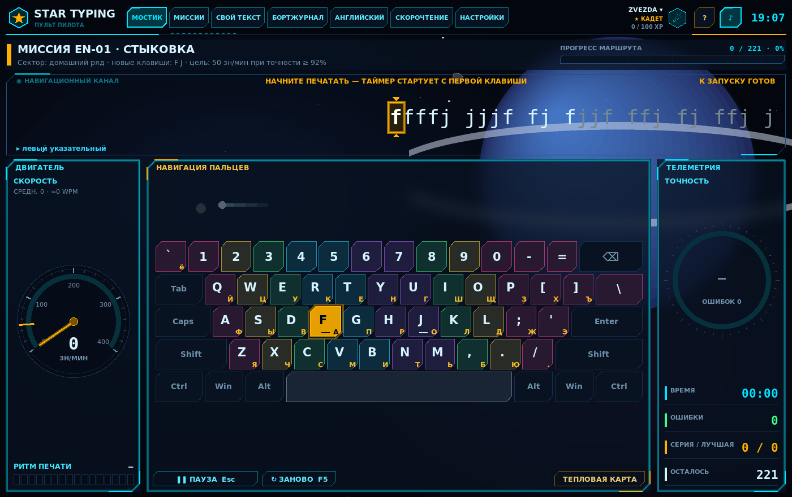 |

1. **«ДОБРО ПОЖАЛОВАТЬ НА БОРТ»** — три шага о разделах и **проверка бортовых систем**: система
   определяется сама (Windows / Linux, можно поправить), рядом — что установлено: Pillow, озвучка
   (SAPI в Windows, espeak-ng в Linux), vosk + sounddevice, модель речи. Чего-то нет — одна кнопка
   **«УСТАНОВИТЬ ВСЁ»** (pip; системные пакеты Linux — через окно пароля, или покажет команду `sudo apt …`).
2. **«СОЗДАТЬ ПИЛОТА И НАЧАТЬ»** (Enter) — позывной, эмблема, цвет, код доступа по желанию.
3. **Мостик** с первой миссией (клавиши F и J) — просто начните печатать. **F1** — инструкция.

### Если что-то не так
| Проблема | Решение |
|---|---|
| `python` не найден / «Python не установлен» (Windows) | запустите `install.bat`; если winget нет — поставьте Python с python.org с галочкой **Add python.exe to PATH**, перезапустите `install.bat` |
| Открывается Microsoft Store вместо Python | Параметры → Приложения → Псевдонимы выполнения приложений → выключите `python.exe`/`python3.exe`, затем `install.bat` |
| Нет фона «Живой космос», в настройках «Не установлен Pillow» | кнопка «УСТАНОВИТЬ ВСЁ» в приветствии или `install.bat` / `bash install.sh` |
| Linux: `No module named tkinter` | `sudo apt install python3-tk` (или просто `bash install.sh`) |
| Linux: `externally-managed-environment` при pip | ставьте через `bash install.sh` — он делает отдельную `.venv` |
| Не слышно звуков / озвучки (Linux) | `sudo apt install alsa-utils espeak-ng`; проверьте: `espeak-ng "hello"` |
| Микрофон не работает | Windows: Параметры → Конфиденциальность → Микрофон → разрешить приложениям; Linux: `sudo apt install libportaudio2`, выберите микрофон в настройках звука. Без микрофона «говорение» переходит на самооценку |
| Данные | Windows: `%APPDATA%\Stamina`, Linux: `~/.local/share/StarTyping` |

*Бывший **Stamina**.*

Star Typing — настольная программа на Python (tkinter) в стиле **пульта
космического корабля**. У неё **три цели**:

1. **Слепая печать** — скорость, точность, ритм, миссии по рядам клавиатуры
   (английская QWERTY и русская ЙЦУКЕН), звания и бортжурнал.
2. **Изучение английского** — вы загружаете книгу или статью на английском и
   печатаете её, а панель **UPLINK** показывает перевод **текущего слова**
   (под прицелом, с красной подсветкой нужной буквы) и **всего предложения**.
   Печать и словарь идут одним потоком: пальцы учатся, мозг запоминает слова
   в контексте.
3. **Скорочтение** — гипердрайв (чтение по слову с красной буквой-точкой фиксации и
   плавным разгоном), проверка понимания и тренажёры обзора: таблицы Шульте и Горбова,
   пирамида, вспышка. Библиотека текстов общая с печатью: книгу можно и читать, и печатать.

С версии 3.4 за одним компьютером может заниматься **целый экипаж**: у каждого пилота свой
профиль (позывной, эмблема, необязательный код доступа) и весь свой прогресс, а **ДОСКА ПОЧЁТА**
показывает, кто впереди.

Для печати внешних зависимостей нет: только стандартная библиотека Python 3.10+. Для фона
«Живой космос» и своих аватаров пилотов нужен **Pillow** (есть в `requirements.txt`; без него
программа работает, фон выключен).
Вкладка **«АНГЛИЙСКИЙ»** работает без интернета; для проверки произношения нужны
`vosk` и `sounddevice` (необязательно, см. «Установка»).

> **Название.** С версии 3.1 программа называется **Star Typing** (раньше — **Stamina**).
> Внутренние имена остались прежними, чтобы не сломать ярлык и не потерять прогресс:
> папка `D:\My_New_Stamina`, точка входа `main.py`, пакет `stamina/`, данные в `%APPDATA%\Stamina`,
> репозиторий `Teslyar75/My_Stamina`.

## Скриншоты: все разделы

Все снимки сделаны на версии 3.3.0 с демо-текстом на чистом профиле.

**Мостик — печать своего текста с UPLINK.** Текст едет через прицел, текущая буква в янтарной
рамке. Под ним UPLINK: набираемое слово с **красной** буквой, которую нужно нажать, его перевод
(`she → она`) и перевод всего предложения. Внизу — двигатель (скорость), клавиатура с зонами
пальцев, точность и телеметрия.
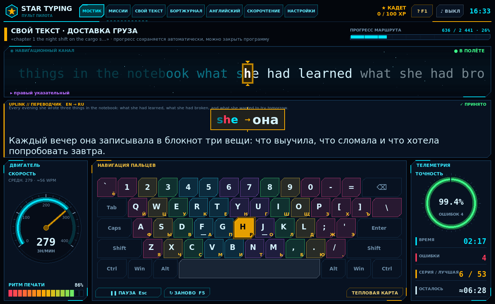

| Миссии: звёздная карта (Ctrl+2) | Отчёт о полёте после миссии |
| --- | --- |
| 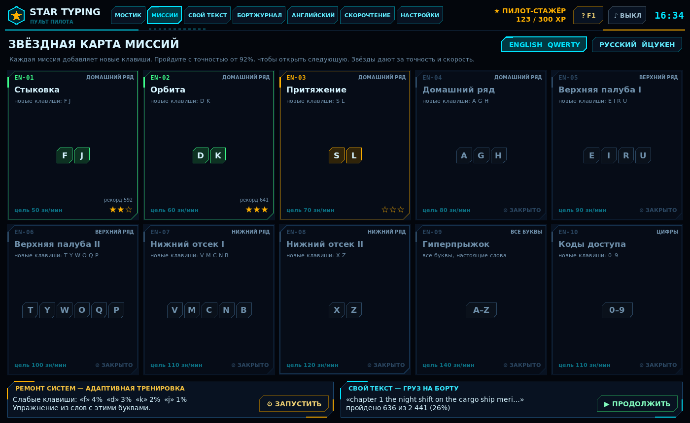 | 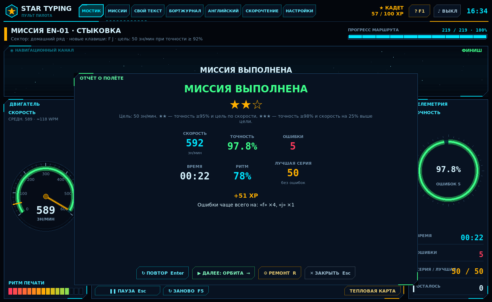 |
| 10 английских и 10 русских миссий по рядам клавиатуры, звёзды, «Ремонт систем», продолжение своего текста. | Скорость, точность, ритм, звёзды и XP; Enter — повтор, → — следующая миссия, R — ремонт слабых клавиш. |
| **Свой текст: подготовка груза (Ctrl+3)** | **Бортжурнал (Ctrl+4)** |
| 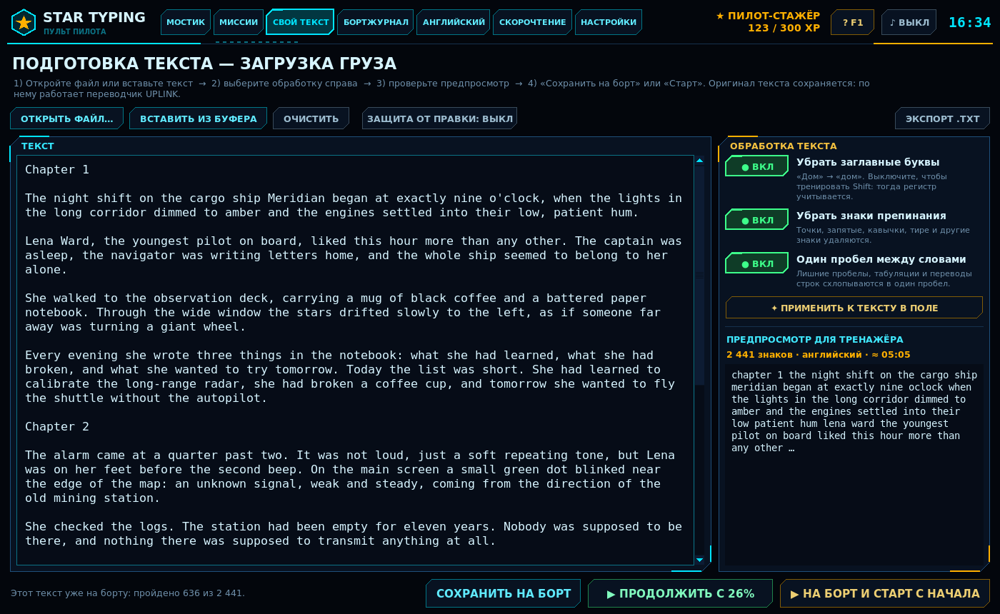 | 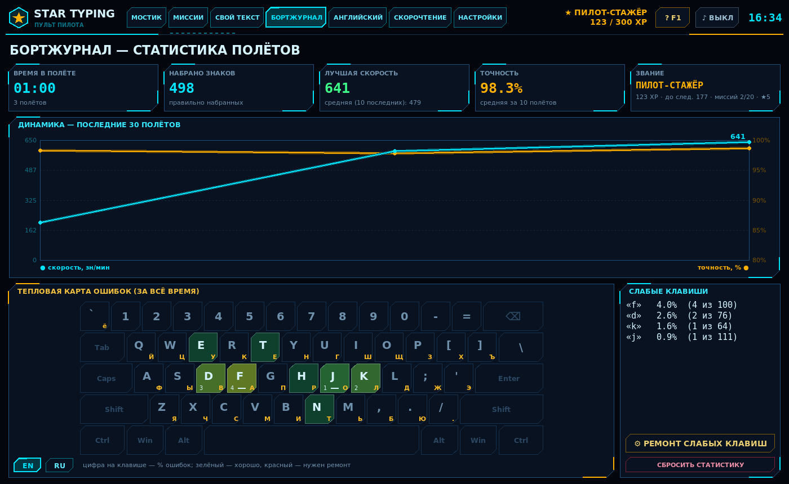 |
| Файл или буфер, переключатели «без заглавных / без знаков / один пробел», предпросмотр, продолжение с места. | Время в полёте, рекорды, график последних заходов, тепловая карта ошибок и слабые клавиши. |
| **Английский (Ctrl+5)** | **Скорочтение (Ctrl+6)** |
| 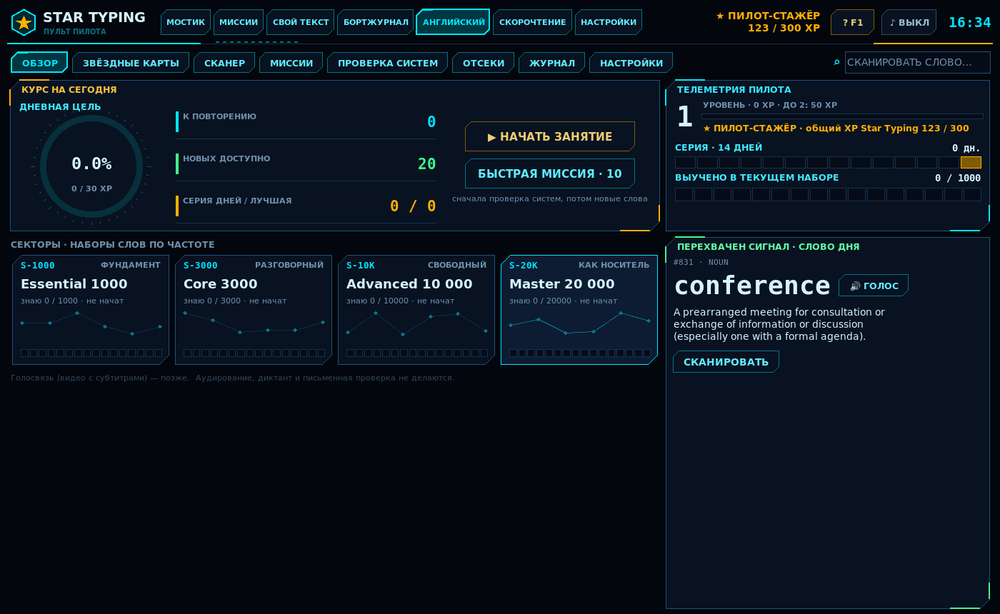 | 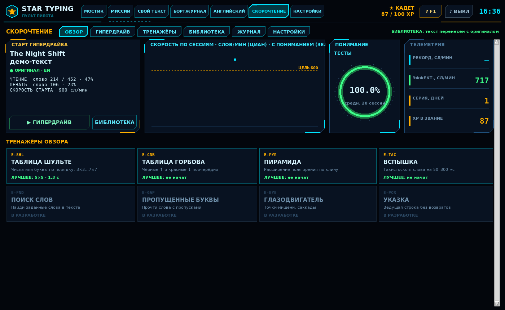 |
| 20 000 слов по частотности, сканер слова с переводом и произношением, миссии с микрофоном, карточки SM-2. Подробно — [ниже](#вкладка-английский-версия-32). | Гипердрайв, проверка понимания, тренажёры обзора, библиотека и журнал. Подробно — [ниже](#вкладка-скорочтение-версия-33). |
| **Настройки (Ctrl+7)** | **Справка (F1)** |
| 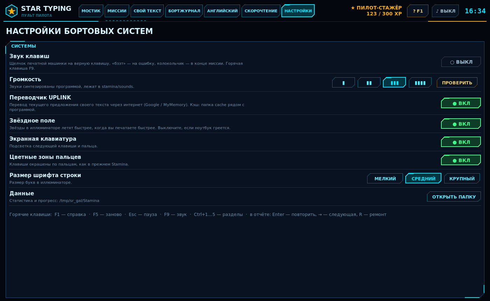 | 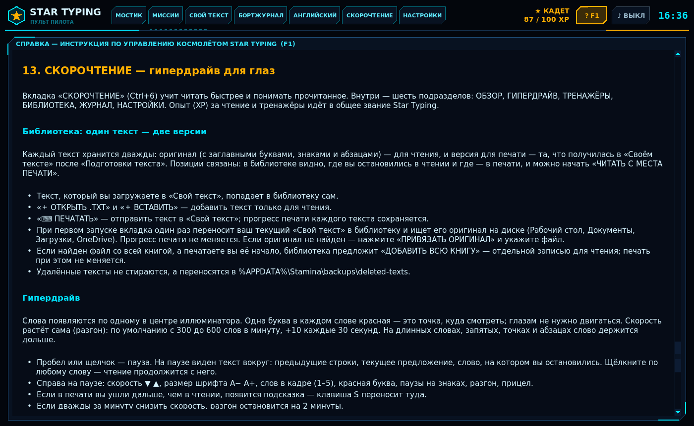 |
| Звук и громкость, переводчик, звёзды, клавиатура, зоны пальцев, размер шрифта. | Инструкция пилота; F1 на вкладке сразу открывает её главу. |
| **Вход в кабину: экипаж (версия 3.4)** | **Доска почёта** |
| 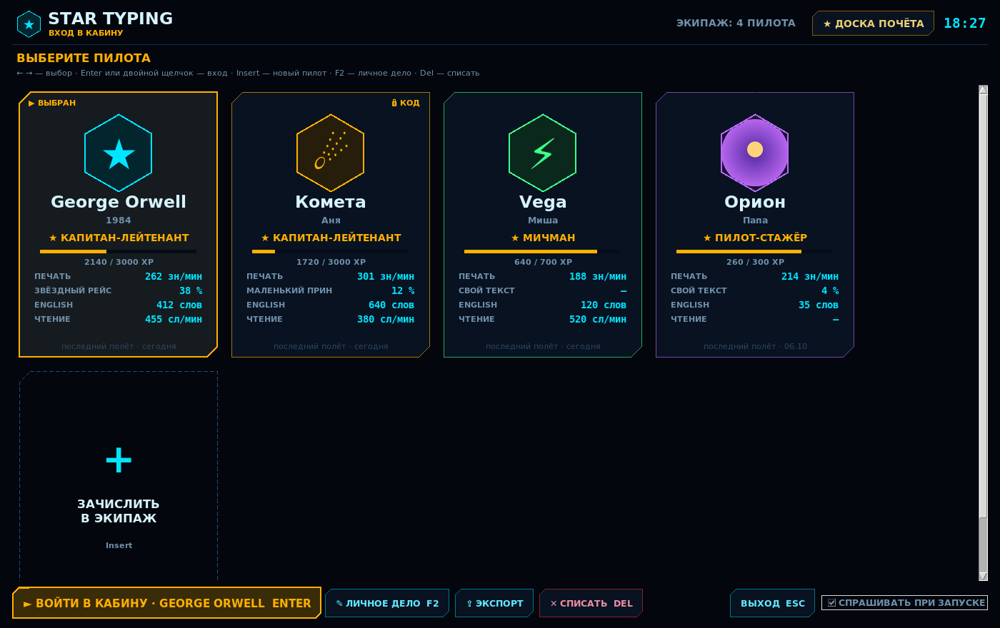 | 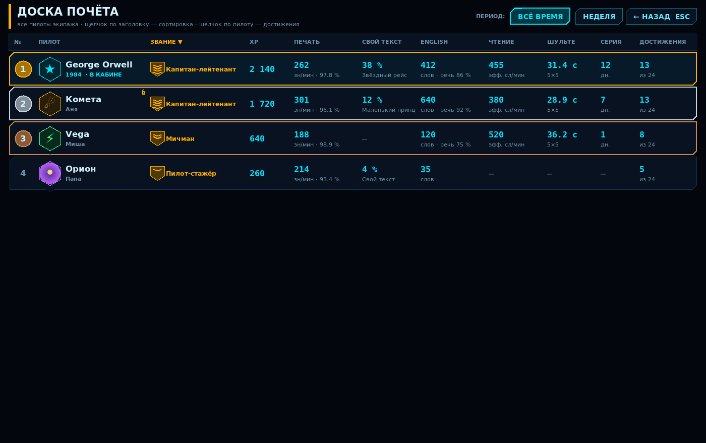 |
| Карточки пилотов: эмблема, звание, печать, свой текст, английский, чтение. Подробно — [ниже](#экипаж-и-доска-почёта-версия-34). | Все пилоты по званию и XP, медали за первые три места, сортировка по любой колонке. |

Подробная инструкция для пилота: [ИНСТРУКЦИЯ.md](ИНСТРУКЦИЯ.md) (в программе открывается клавишей F1).

Промпты для вайбкодинга (воссоздать проект с нуля или дорастить фичи в Cursor): [VIBE_CODING.md](VIBE_CODING.md).

## Разделы

| Раздел | Клавиши | Что там |
| --- | --- | --- |
| **Мостик** | Ctrl+1 | Тренировка: иллюминатор со строкой набора, спидометр, кольцо точности, ритм, телеметрия, клавиатура, переводчик UPLINK |
| **Миссии** | Ctrl+2 | 10 английских и 10 русских миссий, звёзды, «Ремонт систем», продолжение своего текста |
| **Свой текст** | Ctrl+3 | Подготовка текста: файл или буфер, переключатели «без заглавных / без знаков / один пробел», предпросмотр, сохранить, старт, продолжить |
| **Бортжурнал** | Ctrl+4 | Время в полёте, рекорды, график 30 последних заходов, тепловая карта ошибок, слабые клавиши |
| **Английский** | Ctrl+5 | 20 000 слов по частотности: наборы, карточка слова с переводом и произношением, миссии с микрофоном и «СОВПАДЕНИЕ %», флеш-карточки SM-2, свои списки |
| **Скорочтение** | Ctrl+6 | Гипердрайв (RSVP) с разгоном, проверка понимания, таблицы Шульте и Горбова, пирамида, вспышка, общая библиотека текстов, журнал |
| **Настройки** | Ctrl+7 | Звук и громкость, переводчик, звёзды, клавиатура, зоны пальцев, размер шрифта |

### Мостик
- **Иллюминатор** — текст «проезжает» через неподвижный прицел в центре (идея исходного
  Stamina). Набранное уходит влево и тускнеет, текущая буква в янтарной рамке.
  Ошибка — красная вспышка и подсказка «нажато «ы» — нужно «s»»; если перепутана
  раскладка, программа подскажет переключить её.
- **Звёзды** летят быстрее, когда вы печатаете быстрее (можно выключить).
- **Двигатель** — спидометр: живая скорость в знаках в минуту, средняя скорость и WPM
  (слов в минуту), янтарная отметка — цель миссии.
- **Телеметрия** — точность, время, ошибки, серия без ошибок, сколько осталось.
- **Ритм печати** — насколько ровно вы печатаете (100 % — как метроном).
- **Навигация пальцев** — клавиатура с подписями EN и RU, цветные зоны пальцев,
  следующая клавиша подсвечена, внизу иллюминатора подсказка, каким пальцем жать.
  Кнопка «Тепловая карта» показывает процент ошибок на каждой клавише.
- **UPLINK // ПЕРЕВОДЧИК** (только для своего текста) — см. отдельный раздел ниже.

### В чём фишка: печать + английский (UPLINK)

Панель UPLINK под иллюминатором — это и есть «учебный канал»:

| Элемент | Что показывает |
| --- | --- |
| Строка сверху | исходное английское предложение |
| **Окошко по центру (под прицелом)** | набираемое **слово**: слева оригинал, справа перевод; **красная** буква — та, которую нужно нажать сейчас; уже набранные буквы слова приглушены |
| Строка под окошком | перевод **всего предложения** крупным шрифтом |

Так вы не отрываетесь от набора: слово запоминается в момент печати, а предложение
даёт контекст. Для русского «груза» направление перевода обратное (RU → EN).
Переводчик работает в фоне, кэширует ответы и не тормозит печать.

### Время считается честно
Таймер стартует с первой нажатой клавиши. Если вы отошли и не печатали больше 4 секунд,
это время не засчитывается. **Esc** — пауза (Esc или Пробел — продолжить). Если окно
теряет фокус или вы уходите в другой раздел, полёт ставится на паузу сам.

### Миссии и звания
Каждая миссия добавляет новые клавиши: домашний ряд → верхний ряд → нижний ряд →
все буквы → цифры. Миссия засчитана при точности от 92 %:
★ — засчитано, ★★ — точность ≥ 95 % и скорость не ниже цели,
★★★ — точность ≥ 98 % и скорость на 25 % выше цели. Пройденная миссия открывает следующую.
За каждый заход начисляется опыт (XP), звания: Кадет → Пилот-стажёр → Мичман →
Лейтенант → Капитан-лейтенант → Капитан → Коммодор → Адмирал флота.

**Ремонт систем** — программа запоминает ошибки по каждой клавише и собирает упражнение
из слов, в которых много ваших «слабых» букв.

### Свой текст: главная функция Star Typing
Раздел **«Свой текст»** (Ctrl+3), панель «Подготовка текста — загрузка груза»:
1. **Открыть файл…** (`.txt`, UTF-8 или Windows-1251) или **Вставить из буфера**.
2. Справа, в панели **«Обработка текста»**, три независимых переключателя (по умолчанию включены все):
   - **Убрать заглавные буквы.** Если выключить, регистр учитывается, и вы тренируете Shift;
   - **Убрать знаки препинания.** Если выключить, знаки остаются, а типографские
     « » — … заменяются на обычные " - ..., чтобы их можно было набрать;
   - **Один пробел между словами.** Лишние пробелы, табуляции и переводы строк схлопываются.
3. **✦ Применить к тексту в поле** — выбранная обработка применяется прямо к тексту в редакторе
   (как «Применить все правки» в прежней версии).
4. **Предпросмотр для тренажёра**: что именно попадёт в строку набора, сколько знаков, язык и
   сколько времени займёт текст при вашей скорости.
5. **Сохранить на борт** (текст готов, старт с первой клавиши на Мостике), **На борт и старт с
   начала** или **Продолжить с …%**.
6. Ещё есть **Очистить**, **Защита от правки** (поле только для чтения) и **Экспорт .txt**
   (сохранить подготовленный текст в файл).

Оригинал текста сохраняется: по нему переводчик понимает, где кончается предложение.
Прогресс сохраняется автоматически, программу можно закрыть в любой момент и
потом нажать «Продолжить». Незаконченный текст из версии 2 (например, «1984»)
продолжается с того же места. Если заново открыть тот же файл, можно продолжить с того же
места, и переводчик начнёт работать по предложениям.

### Звук
- верная клавиша — щелчок печатной машинки;
- ошибка — глухой «бззт»;
- миссия выполнена — колокольчик каретки.

Звуки синтезирует сама программа (`stamina/sounds.py`), файлы лежат в `stamina/sounds/`.
Включить или выключить звук: F9 или кнопка «ЗВУК» вверху. Громкость меняется в настройках.

### Переводчик UPLINK (технически)
- Переводит **слово** и **предложение** отдельно (оба запроса кэшируются).
- Перевод идёт в фоне, печать никогда не тормозит.
- Сначала бесплатный Google Translate (без ключа), запасной вариант — MyMemory.
- Кэш: `cache/translations.json` рядом с программой — повторные фразы работают офлайн.
- Нет сети — на панели «НЕТ СВЯЗИ», повтор раз в 20 секунд.
- Выключается в настройках.

## Вкладка «АНГЛИЙСКИЙ» (версия 3.2)

Тренажёр английских слов прямо на борту — в том же стиле пульта, с теми же званиями и XP.
Работает без интернета, без регистрации и без платных сервисов.

- **20 000 слов** по частотности, четыре набора: Essential 1000, Core 3000, Advanced 10 000, Master 20 000.
- **Карточка слова (СКАНЕР):** определение, IPA, слоги и ударение, подсказки по трудным звукам,
  русский перевод (поле «МОЙ ПЕРЕВОД» заполнено заранее, свой вариант главнее), примеры
  предложений с переводом, озвучка обычной и медленной скоростью (голос Windows).
- **Проверка произношения:** читаете предложение в микрофон, распознавание Vosk без интернета
  показывает «СОВПАДЕНИЕ: 86%» и подсвечивает пропущенные слова. Индикатор «● СЛУШАЮ…» с живой
  шкалой громкости, затем «РАСПОЗНАЮ…». Без микрофона — самооценка.
- **Миссии** (говорение, чтение, вопросы), **флеш-карточки** с интервальным повторением SM-2,
  **отсеки** (свои списки, экспорт CSV, импорт из .txt), **журнал** со знаками отличия.
- F1 на вкладке открывает главу «12. АНГЛИЙСКИЙ» в [инструкции](ИНСТРУКЦИЯ.md).

| Обзор | Звёздные карты (плитки с переводом) |
| --- | --- |
|  |  |
| **Сканер: перевод и «СОВПАДЕНИЕ %»** | **Миссии** |
|  |  |
| **Проверка систем (карточки)** | **Отсеки** |
|  |  |
| **Журнал** | **Настройки** |
|  |  |

### Наборы слов: объём и примеры

Посчитано по `stamina/english/data/vocab.json`. Наборы вложены: Core 3000 включает Essential 1000 и т. д.

| Набор | Слов всего | Новых в наборе | Примеров (новые слова) | из них с переводом | Примеров всего (накопительно) | ≈ уровень CEFR |
| --- | ---: | ---: | ---: | ---: | ---: | --- |
| Essential 1000 | 1 000 | 1 000 | 4 983 | 4 983 | 4 983 | A1–A2 |
| Core 3000 | 3 000 | 2 000 | 9 610 | 9 610 | 14 593 | B1 |
| Advanced 10 000 | 10 000 | 7 000 | 24 138 | 24 138 | 38 731 | B2–C1 |
| Master 20 000 | 20 000 | 10 000 | 15 236 | 15 233 | 53 967 | C2 / почти как носитель (пассивно) |
| **Итого** | **20 000** | **20 000** | **53 967** | **53 964** | **53 967** | |

Хотя бы один пример есть у 19 935 слов из 20 000. Соответствие CEFR примерное: это часто приводимые оценки по объёму словаря, а уровень зависит не только от количества слов (ещё грамматика, аудирование, речь, письмо).

Словарь (`stamina/english/data/vocab.json`) собран нашими скриптами только из открытых
источников — список и лицензии ниже, подробности в [docs/ENGLISH_DATA.md](docs/ENGLISH_DATA.md), скрипты сборки — в [tools/vocab_builder/](tools/vocab_builder/).
Устройство вкладки: [docs/ENGLISH_TAB.md](docs/ENGLISH_TAB.md), стиль: [docs/ENGLISH_DESIGN.md](docs/ENGLISH_DESIGN.md).

## Вкладка «СКОРОЧТЕНИЕ» (версия 3.3)

Тренажёр быстрого чтения в том же стиле пульта. Подразделы: **ОБЗОР**, **ГИПЕРДРАЙВ**,
**ТРЕНАЖЁРЫ**, **БИБЛИОТЕКА**, **ЖУРНАЛ**, **НАСТРОЙКИ**. XP за чтение и тренажёры идёт в общее
звание Star Typing. F1 на вкладке открывает главу «13. СКОРОЧТЕНИЕ» в [инструкции](ИНСТРУКЦИЯ.md).

### Обзор

Слева — текст для чтения и где вы остановились в чтении и в печати. В центре — график скорости
по сессиям (циан — скорость, зелёный — скорость с учётом понимания, пунктир — цель). Справа —
среднее понимание по тестам, рекорд, серия дней и XP. Ниже — карточки тренажёров с лучшими результатами.

### Гипердрайв: чтение по слову
| Полёт | Несколько слов в кадре |
| --- | --- |
| 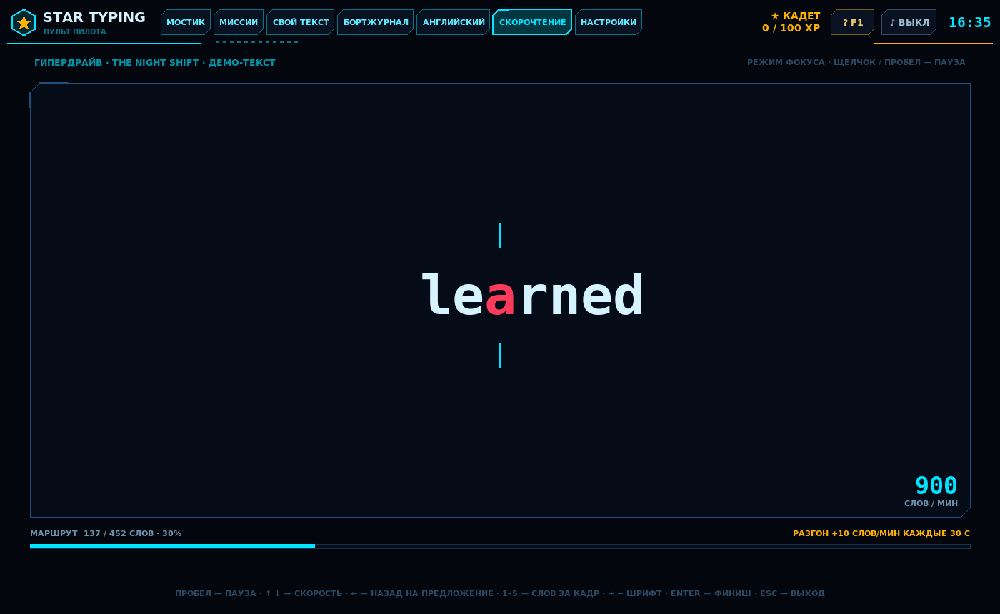 | 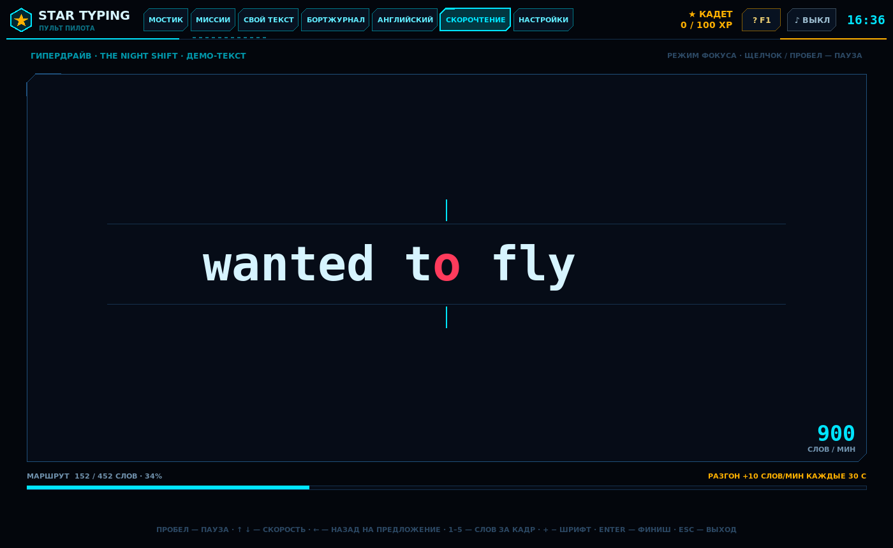 |
| Слово стоит в центре прицела, **красная буква** — точка, куда смотреть: глазам не нужно двигаться. Справа внизу — текущая скорость, снизу — маршрут по тексту и разгон (+10 слов/мин каждые 30 с до цели). | Клавиши 1–5 — сколько слов в кадре. Кадр не переходит через конец предложения; на длинных словах, запятых, точках и абзацах слово держится дольше. |

**Пауза с контекстом** (Пробел):
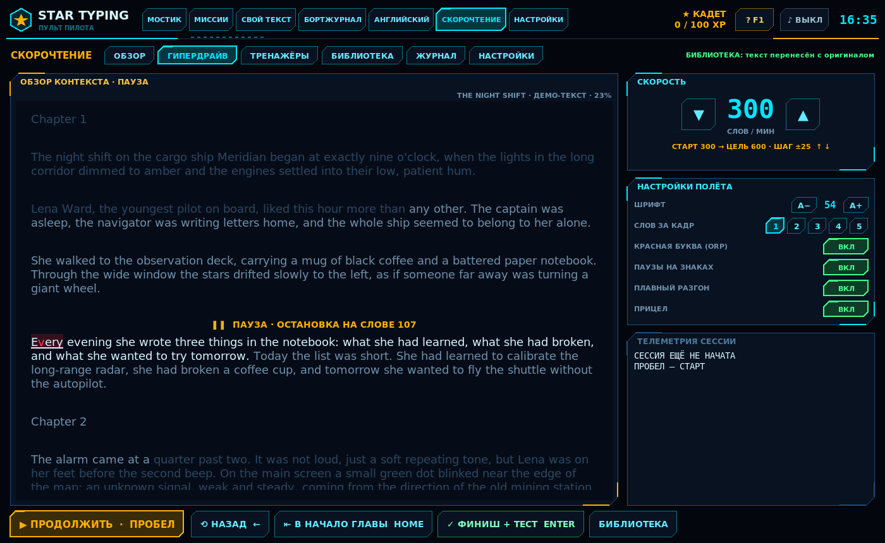
Видно текст вокруг: прошлые абзацы приглушены, текущее предложение ярче, слово остановки подчёркнуто.
Щелчок по любому слову — продолжить с него. Справа — скорость ▼ ▲, размер шрифта A− A+, слов в кадре,
красная буква, паузы на знаках, разгон, прицел и телеметрия сессии. Внизу — назад на предложение,
в начало главы, финиш с проверкой. Если в печати вы ушли дальше, клавиша **S** переносит туда.

### Проверка понимания
| Вопрос | Отчёт о полёте |
| --- | --- |
| 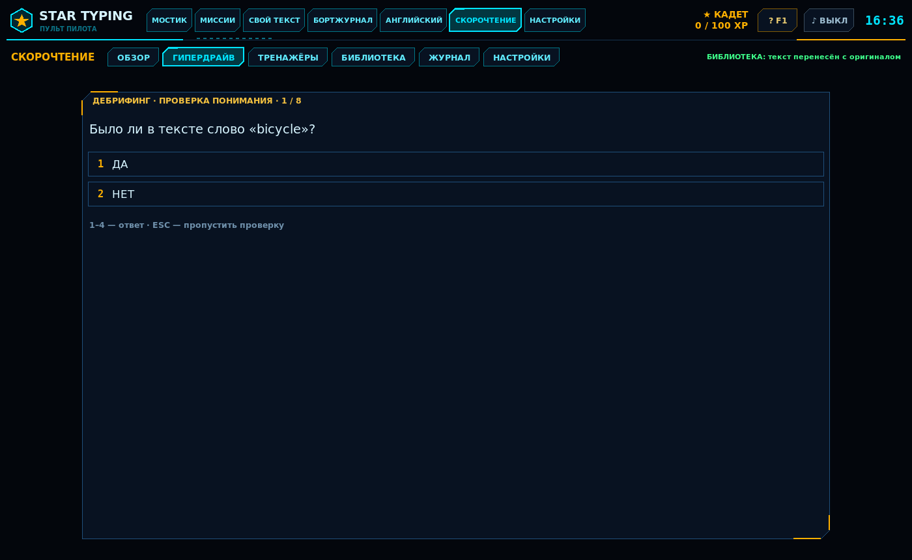 | 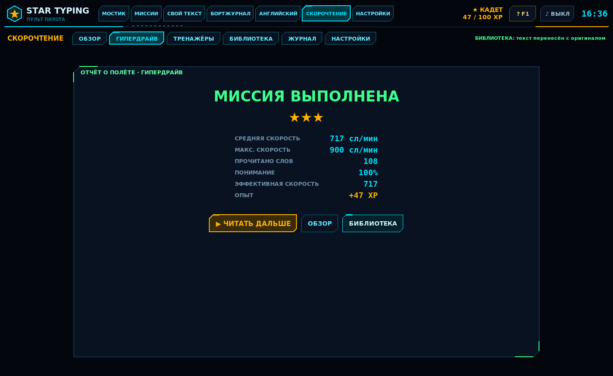 |
| После «ФИНИШ + ТЕСТ» или каждые 1000 слов: «было ли в тексте слово…» и «закончите фразу». Клавиши 1–4. | Средняя и максимальная скорость, понимание, **эффективная скорость** = скорость × понимание, звёзды и XP. |

### Тренажёры обзора
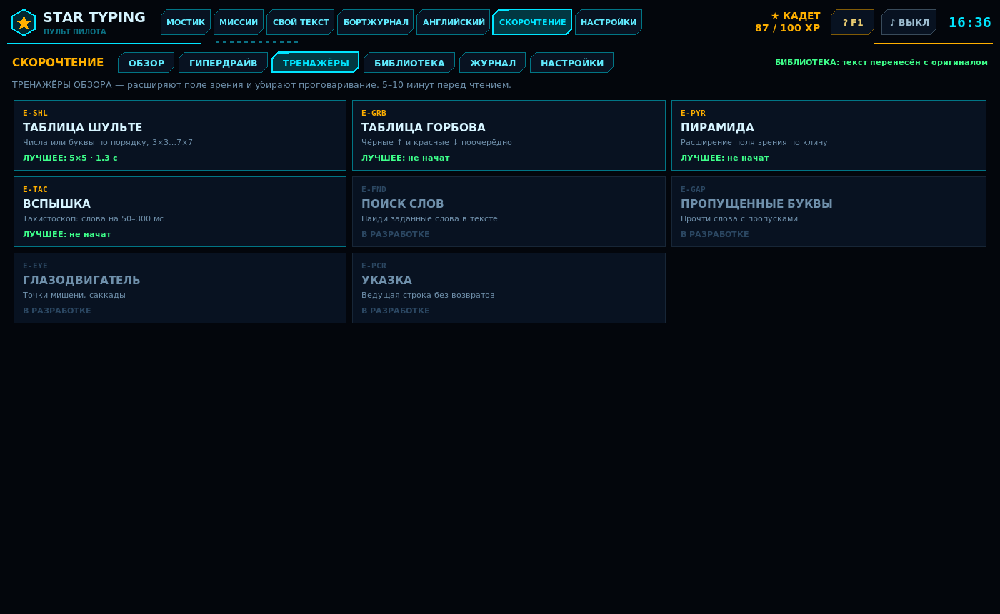
Каталог тренажёров. Готовы четыре; поиск слов, пропущенные буквы, глазодвигатель и указка — в разработке.

| Таблица Шульте | Таблица пройдена |
| --- | --- |
| 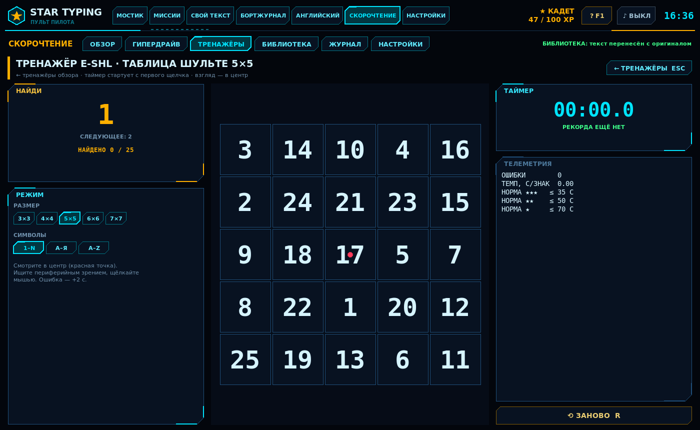 | 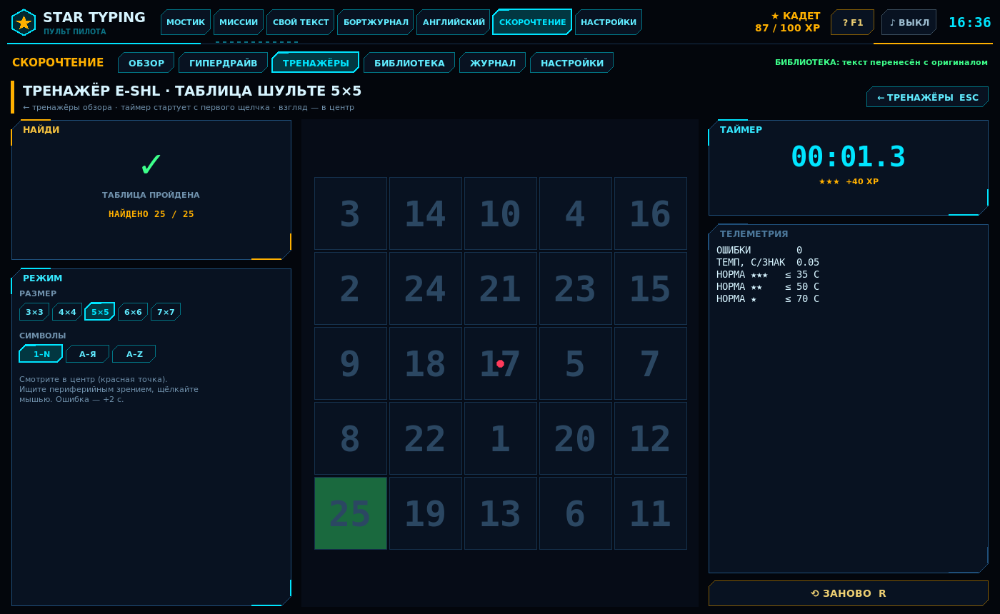 |
| 3×3…7×7, числа или буквы (А–Я, A–Z). Смотрите в красную точку в центре и находите символы по порядку периферийным зрением. Ошибка — +2 с. | Время, темп на знак, нормы на звёзды для выбранного размера, рекорд и XP. |
| **Таблица Горбова** | **Пирамида** |
| 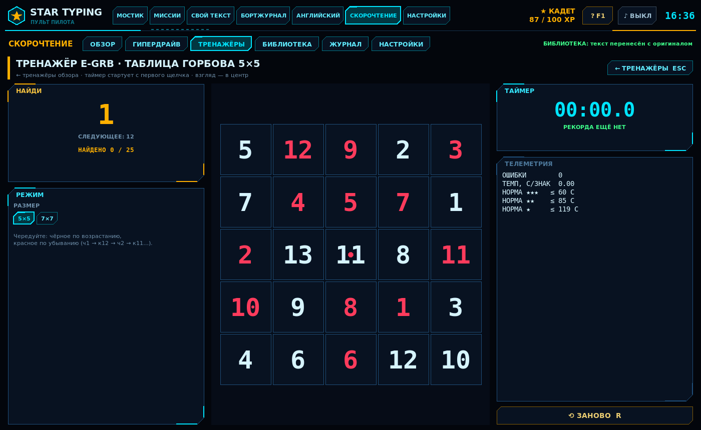 | 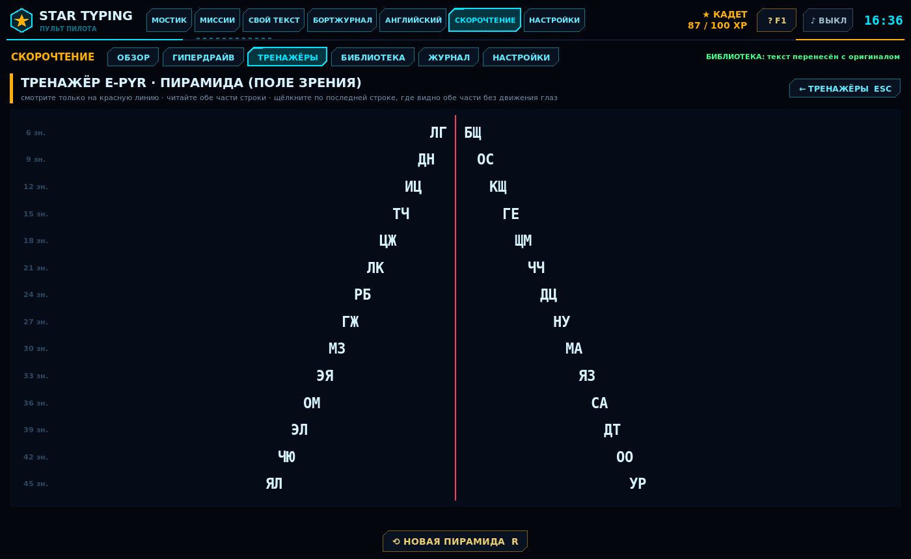 |
| Чёрные числа по возрастанию и красные по убыванию, поочерёдно: ч1 → к12 → ч2 → к11… Тренирует переключение внимания. | Смотрите на красную линию и читайте пары букв по краям; щёлкните по самой широкой строке, которую видно без движения глаз. Результат — ширина поля зрения в знаках. |
| **Вспышка (тахистоскоп)** | **Журнал** |
| 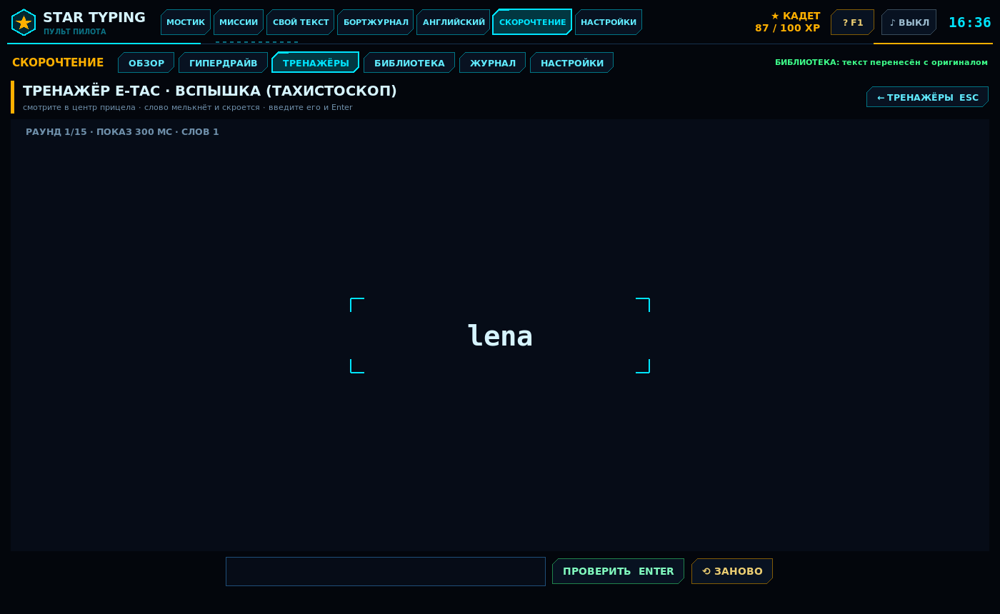 | 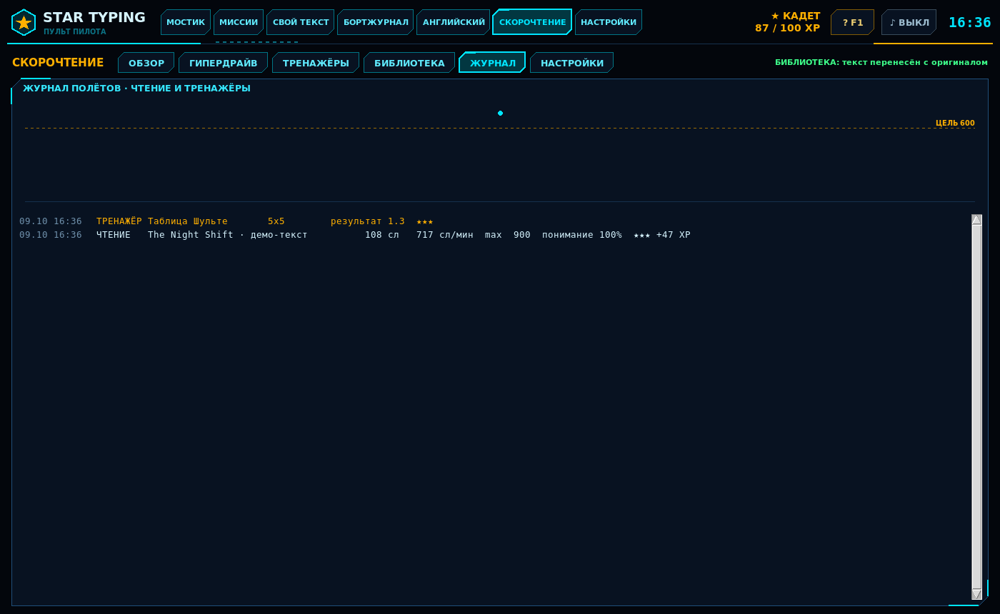 |
| Слово мелькает на доли секунды — введите его. Три верных подряд — показ короче (до 50 мс), потом по 2–3 слова. Слова берутся из текста, который вы читаете. | Все сессии чтения и заходы тренажёров: скорость, понимание, звёзды, XP; сверху — график скорости. |

### Библиотека: один текст — две версии
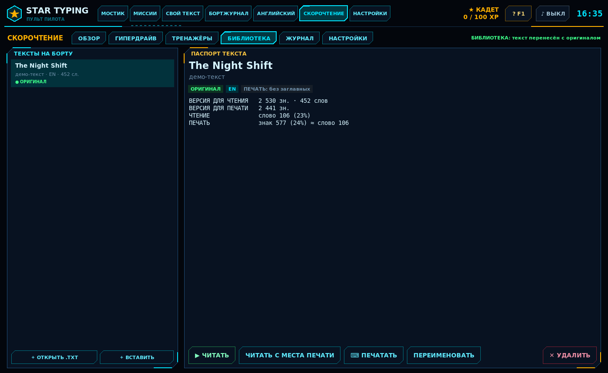
Библиотека общая для печати и чтения. У каждого текста есть **оригинал** (с заглавными, знаками и
абзацами) — для чтения, и **версия для печати** — то, что получилось в «Своём тексте» после подготовки.
Позиции связаны: видно, где вы в чтении и где в печати, можно «ЧИТАТЬ С МЕСТА ПЕЧАТИ» или
«ПЕЧАТАТЬ» с сохранённого места. Тексты из «Своего текста» попадают сюда сами; можно открыть .txt
или вставить текст. При первом запуске вкладка один раз переносит текущий свой текст в библиотеку и
ищет его оригинал на диске; прогресс печати не меняется. Удалённые тексты переносятся в
`backups\deleted-texts`, а не стираются.

### Настройки
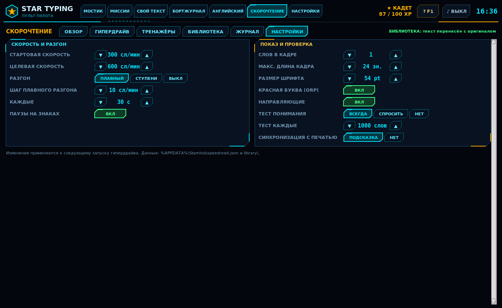
Стартовая и целевая скорость, разгон (плавный, ступени, выключен), шаг, слов в кадре, шрифт,
красная буква, прицел, частота проверки понимания и подсказка синхронизации с печатью.

Устройство вкладки и план: [docs/speedread/](docs/speedread/) (SPEC, TEXT_LIBRARY, макеты).

## Экипаж и ДОСКА ПОЧЁТА (версия 3.4)

За одним ноутбуком занимаются несколько человек — у каждого **свой пилот**: позывной, эмблема,
акцентный цвет, звание и весь прогресс (печать и миссии, свой текст, английский, скорочтение,
библиотека). Данные пилота лежат в своей папке `%APPDATA%\Stamina\pilots\<id>\`, пилоты не видят
и не портят прогресс друг друга. Демо-экипаж на снимках вымышленный.

### Вход в кабину

*Экран выбора пилота при запуске (если пилотов два и больше). Выбранная карточка — в янтарной рамке,
🔒 КОД — у пилота есть код доступа. ← → — выбор, Enter — войти, Insert — новый пилот, F2 — личное дело,
Del — списать, «★ ДОСКА ПОЧЁТА» — рейтинг экипажа.*

| Зачисление в экипаж | Код доступа |
| --- | --- |
| 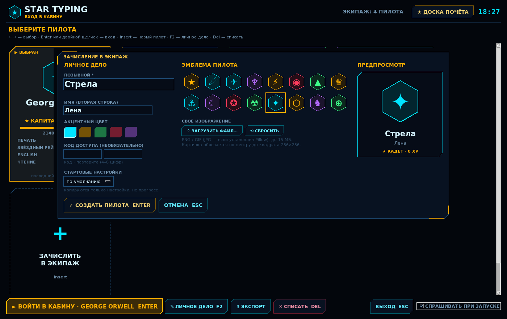 | 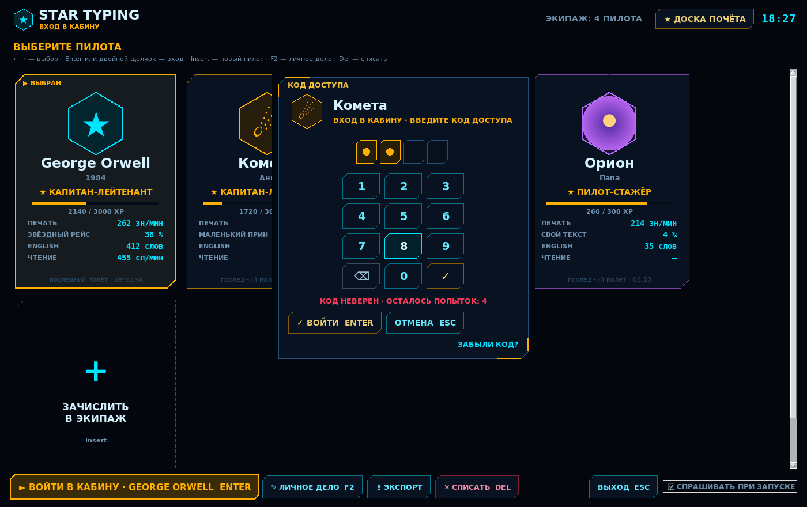 |
| Позывной, имя, цвет, 16 встроенных эмблем или своя картинка, необязательный код, «копировать настройки от…», предпросмотр карточки. | Ячейки-точки и цифровая клавиатура; после 5 ошибок — блокировка с отсчётом. «Забыли код?» — сброс с подтверждением. |
| **Первый запуск после обновления** | **Сброс кода** |
| 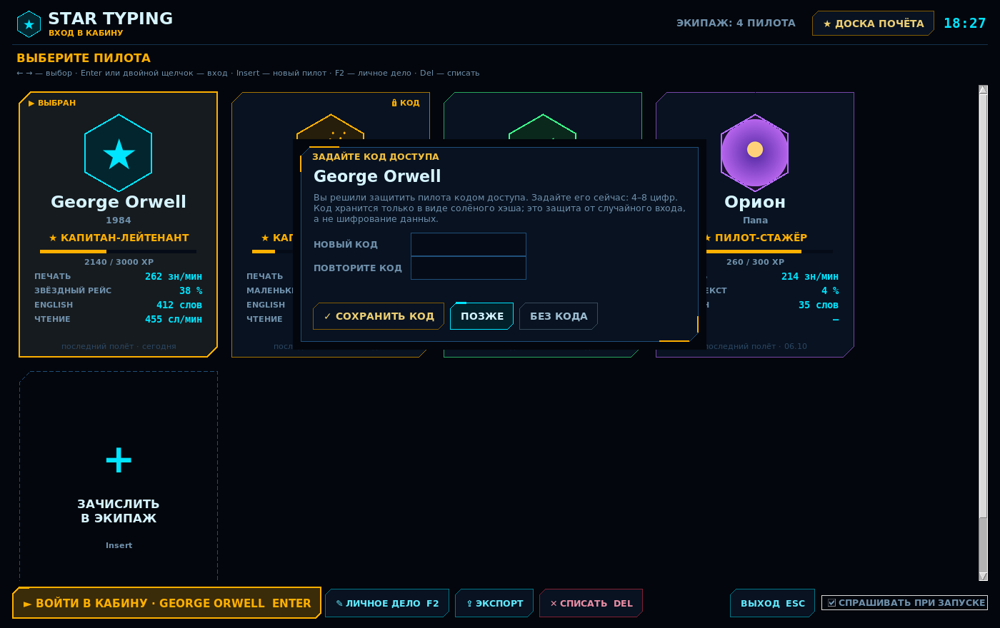 | 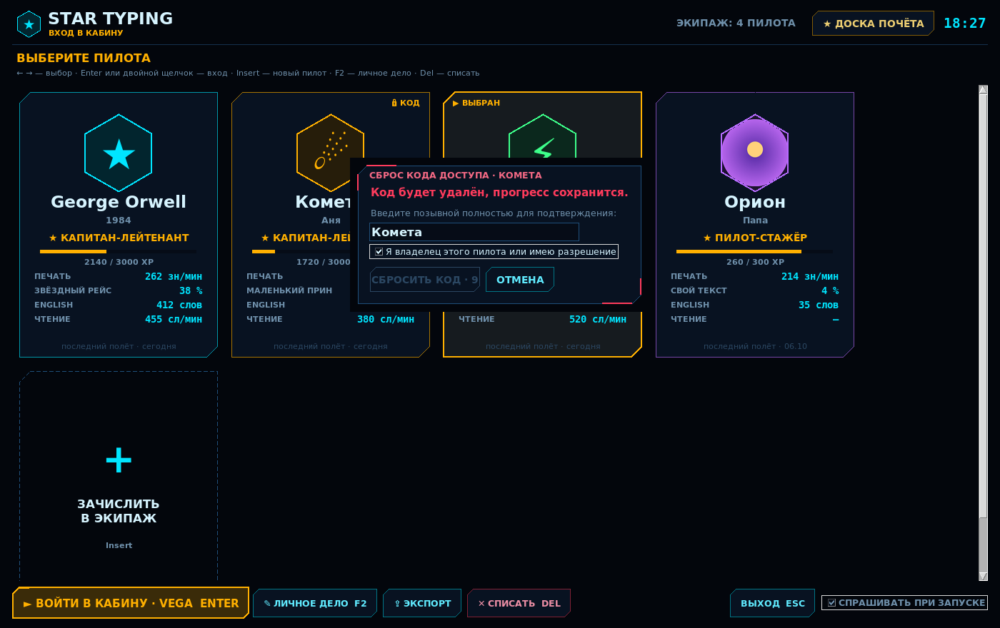 |
| Старый прогресс становится пилотом «George Orwell / 1984»; программа один раз просит задать ему код («Позже» / «Без кода»). | Ввести позывной, отметить «Я владелец…», кнопка оживает через 10 с; прогресс сохраняется. |

### Доска почёта

*Все пилоты экипажа: звание (шеврон), XP, лучшая скорость печати и точность, % своего текста,
английские слова и средний % произношения, эффективная скорость чтения, рекорд Шульте, серия дней
и достижения. Медали за первые три места, щелчок по заголовку — сортировка. Код для просмотра не нужен.*

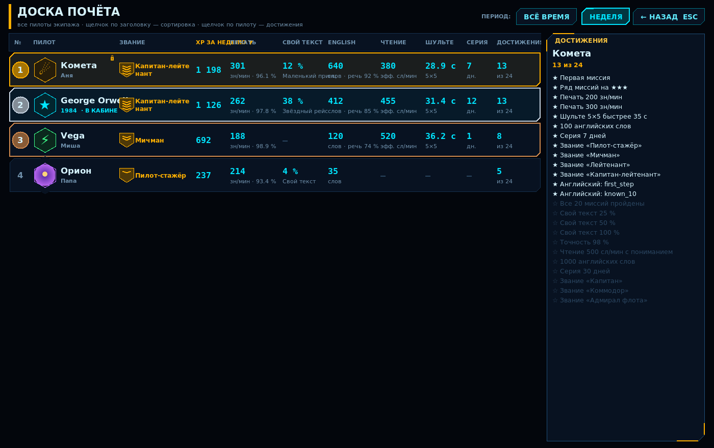
*Период «НЕДЕЛЯ»: XP и рекорды за 7 дней. Щелчок по пилоту открывает список его достижений.*

### В кабине
| Плашка пилота в шапке | Доска почёта из бортжурнала |
| --- | --- |
| 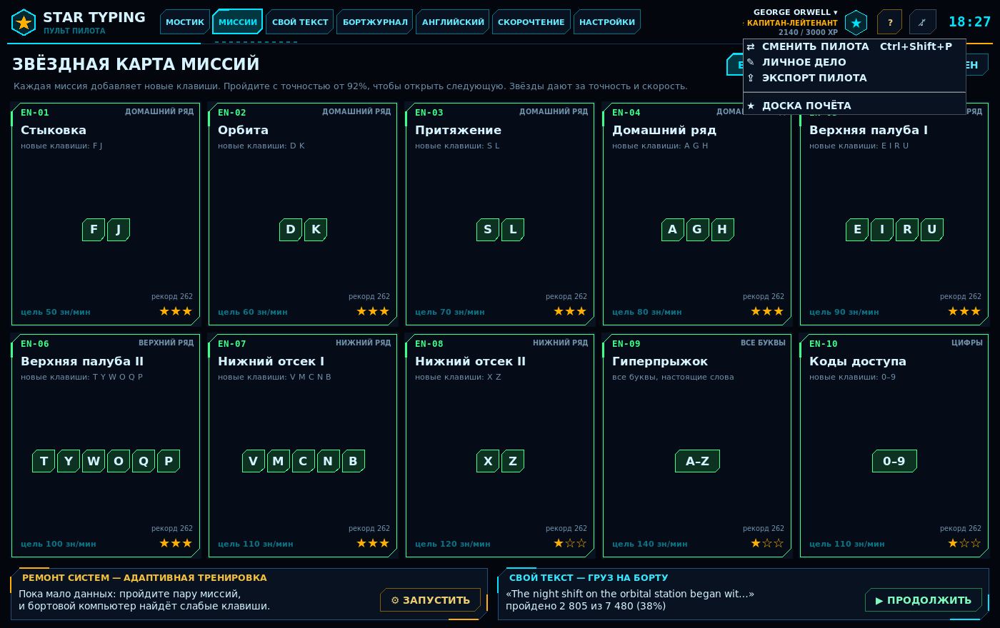 | 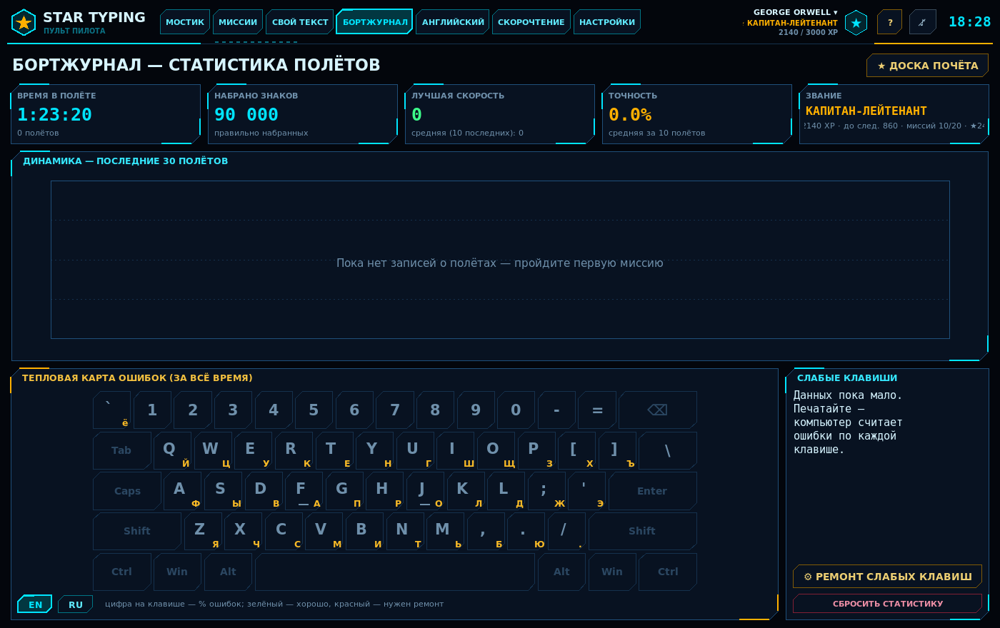 |
| Эмблема, позывной и звание справа в шапке; меню: сменить пилота (Ctrl+Shift+P), личное дело, экспорт, доска почёта. | Кнопка «★ ДОСКА ПОЧЁТА» в бортжурнале. |
| **Списание пилота** | **Доска в кабине** |
| 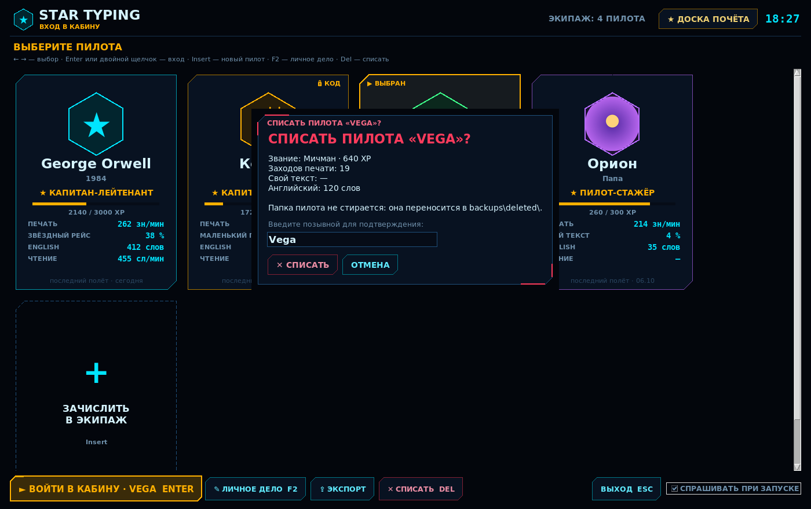 | 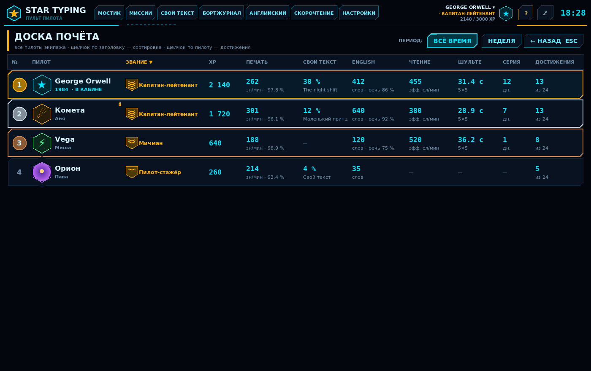 |
| Нужно ввести позывной; папка не стирается, а уходит в `backups\deleted\`. Активного и последнего пилота списать нельзя. | Та же доска внутри кабины; Esc — назад. |

**Как устроено:**
- **Перенос без потерь.** При первом запуске 3.4 прежние данные копируются в пилота №1
  «George Orwell / 1984» с проверкой SHA-256; перед этим — резервная копия
  `backups\pre-pilots-<дата>\`, старые файлы в корне переименовываются в `*.migrated`.
- **Код доступа** — необязательный, 4–8 цифр; хранится только солёный хэш PBKDF2-SHA256
  (200 000 итераций). Это защита от случайного входа в чужой профиль, а не шифрование.
  Кодов по умолчанию нет нигде — ни в программе, ни в тестах, ни в документации.
- **Смена пилота** — всё сохраняется, программа перезапускается с экраном входа. Ярлык на конкретного
  пилота: `main.py --pilot "<позывной>"` (или переменная `STAMINA_PILOT`).
- **Экспорт / импорт** — файл `.stpilot` (zip + манифест с SHA-256); при импорте новый id и свободный позывной.

Устройство и план: [docs/pilots/](docs/pilots/) (SPEC_PILOTS, CURSOR_TASK_PILOTS, макеты).

## Живой космос (версия 3.5)

Во **всех разделах** за полупрозрачными «голографическими» панелями — живой космос: звёзды в трёх
слоях с параллаксом, кометы с хвостами, далёкие планеты (одна с кольцом), астероиды. В открытых
местах (иллюминатор мостика, просветы между панелями, поле карточек на входе в кабину) сцена резкая;
под панелями и кнопками — **матовое стекло**: размыто, затемнено и подкрашено в цвет панели, поэтому
текст, цифры и кнопки остаются чёткими. Когда вы печатаете, корабль «разгоняется», а резкое окно
обновляется реже, чтобы не мешать.

**Настройки → «Живой космос»:** `ВЫКЛ` · `ЛЁГКИЙ` (по умолчанию, до 12 к/с) · `ПОЛНЫЙ` (до 24 к/с,
больше объектов). Если «полный» на вашем компьютере не успевает (кадр > 30 мс 5 секунд подряд),
программа сама переходит на «лёгкий» до перезапуска. При выключенной анимации Windows
(«уменьшение движения») картинка неподвижна. Нужен **Pillow** (`pip install -r requirements.txt`);
без него фон просто выключен.

| Мостик, ожидание | Мостик, полёт |
|---|---|
| 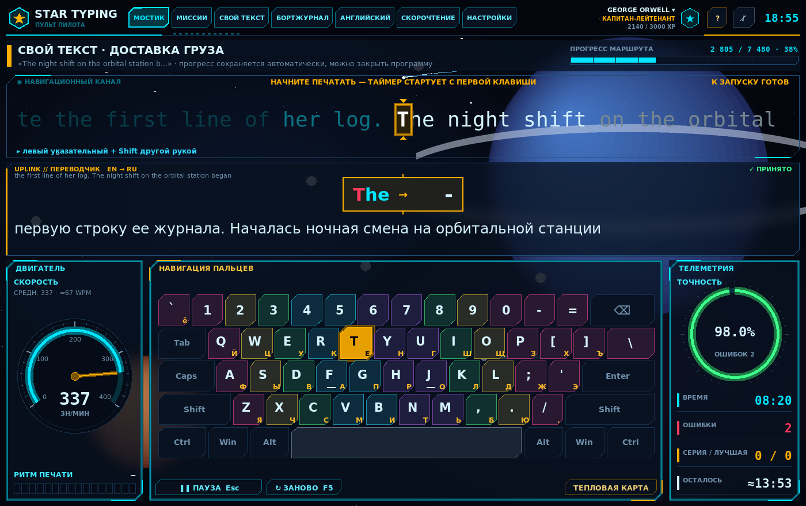 | 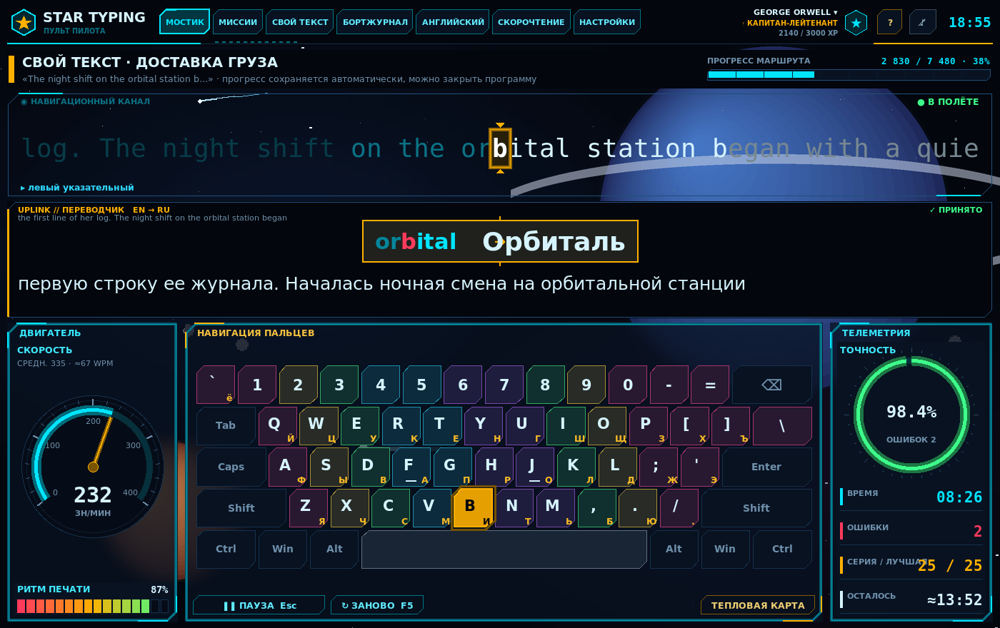 |
| **Миссии** | **Свой текст** |
| 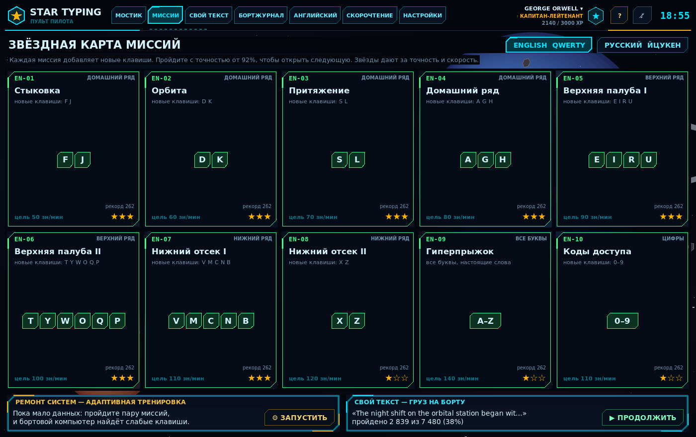 | 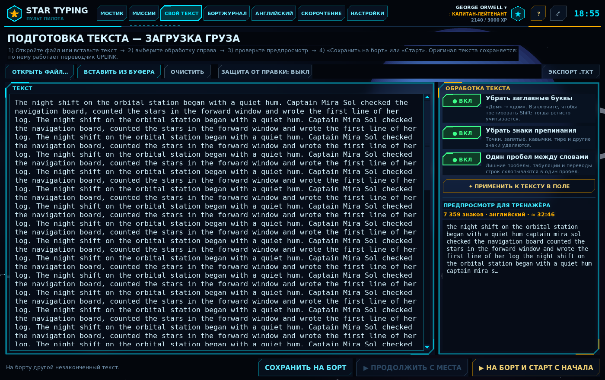 |
| **Бортжурнал** | **Английский** |
| 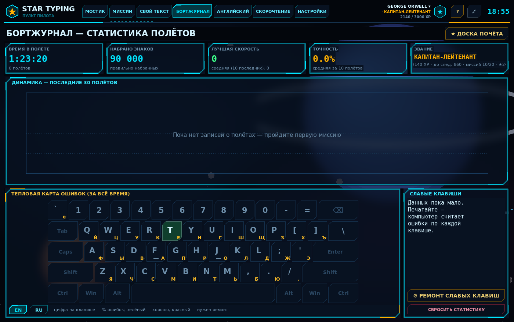 | 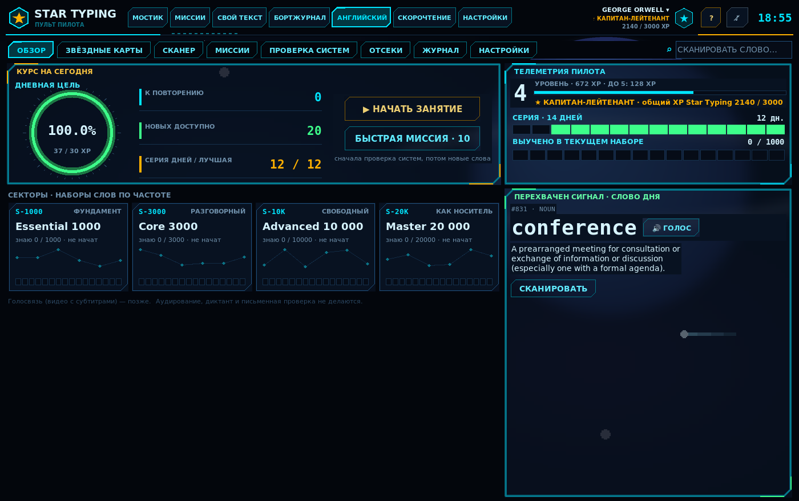 |
| **Скорочтение** | **Настройки** |
| 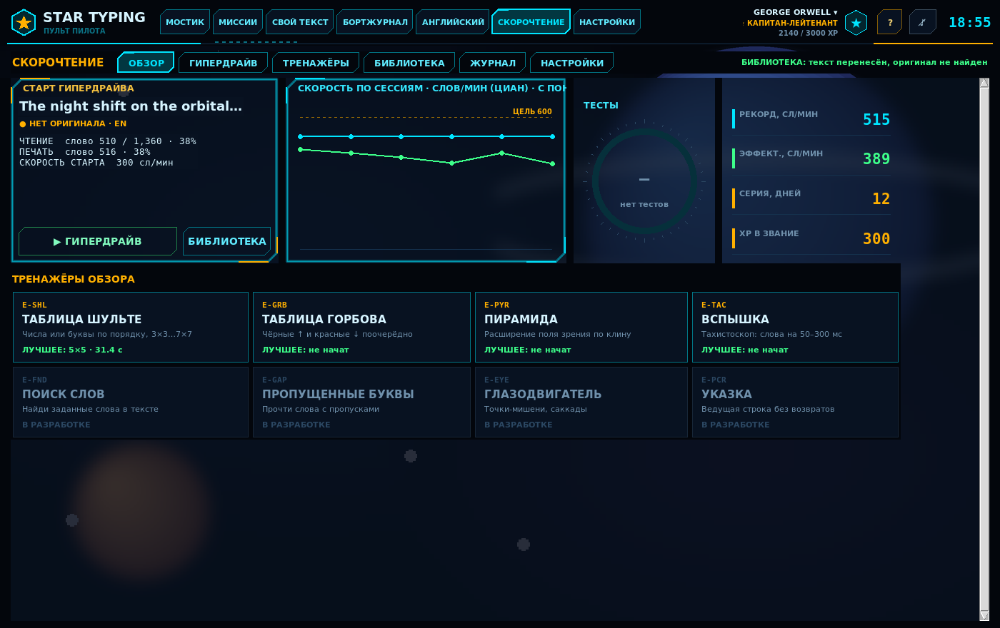 | 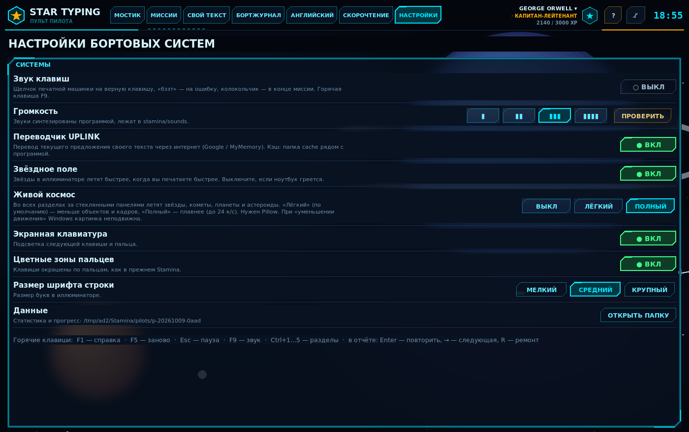 |
| **Вход в кабину** | **Доска почёта** |
| 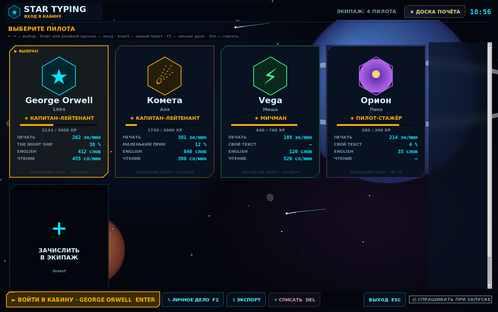 | 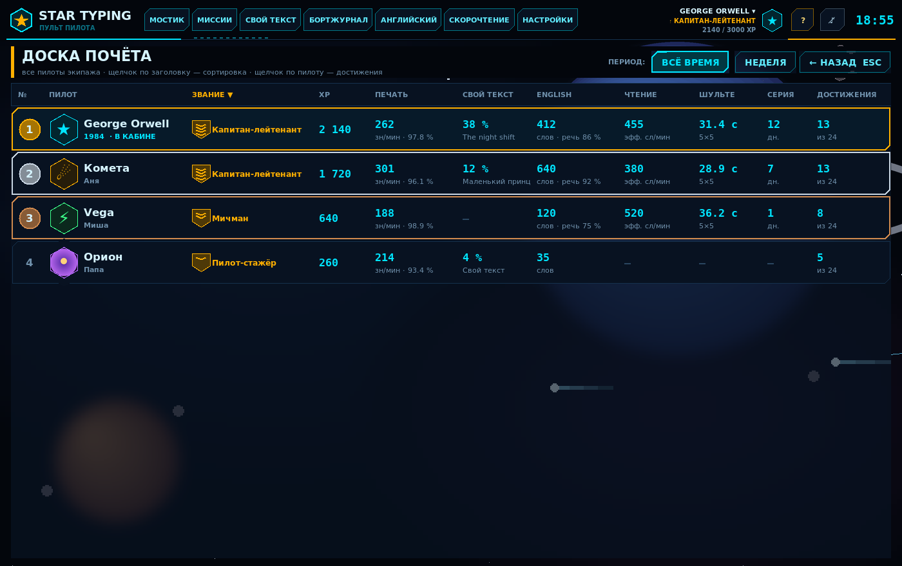 |

Замер на ноутбуке (HP, Ryzen 3, 8 ГБ, окно 1260×800, % одного ядра — весь процесс Star Typing):

| Режим | Простой: к/с · CPU | Печать ~300 зн/мин: к/с · CPU |
|---|---|---|
| ВЫКЛ | — · 8 % | — · 17 % |
| ЛЁГКИЙ | 11 · 11 % | 6 · 22 % |
| ПОЛНЫЙ | 21 · 39 % | 11 · 38 % |

Как это укладывается в слабый ноутбук без numpy: статичный слой (туманности и планеты) кэшируется;
каждый кадр рисуются только звёзды, кометы и астероиды и только в резких окнах; стекло считается в
половинном разрешении и размывается раз в 6 секунд, а между пересчётами перерисовываются только те
панели, над которыми пролетает комета или астероид; изображения вставляются в уже созданные
PhotoImage (`paste`). Подробно — [docs/living_space/SPEC.md](docs/living_space/SPEC.md).

## Горячие клавиши
| Клавиша | Действие |
| --- | --- |
| F1 | справка (инструкция) |
| Esc | пауза / продолжить |
| F5 | начать заново |
| F9 | звук вкл/выкл |
| Ctrl+1…7 | разделы (Ctrl+5 — Английский, Ctrl+6 — Скорочтение, Ctrl+7 — Настройки) |
| Ctrl+Shift+P | сменить пилота (экран «ВХОД В КАБИНУ») |
| Скорочтение: Пробел / ↑ ↓ / ← → / 1–5 / S / Enter | пауза / скорость / по предложениям / слов в кадре / к месту печати / финиш и тест |
| В отчёте: Enter / → / R / Esc | повторить / следующая миссия / ремонт / закрыть |
| **Tab** | без мыши: прыжок в главное меню; ещё раз Tab — к кнопкам раздела |
| **← → ↑ ↓** (кнопка в фокусе) | соседняя вкладка / подвкладка / кнопка |
| **Enter / Пробел** (кнопка в фокусе) | нажать; **Esc** или **Shift+Tab** — убрать фокус |

Кнопка в фокусе отмечена янтарными уголками. Во время полёта на мостике Tab и стрелки идут в печать:
выйти к меню — **Esc**, затем **Tab**. Работает во всех разделах, на экранах приветствия и входа, в диалогах.

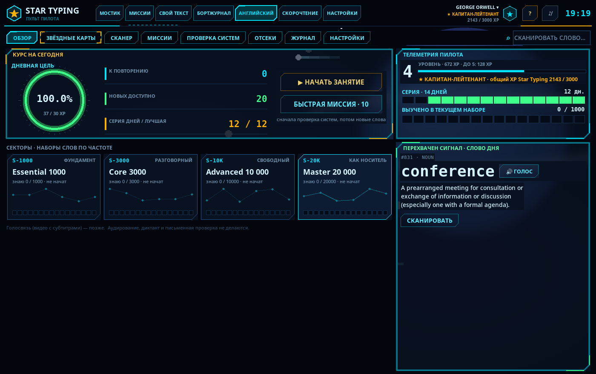

## Где хранятся данные
`%APPDATA%\Stamina\` (на Linux `~/.stamina`). С версии 3.4 там лежат реестр экипажа `pilots.json`,
общий `app.json` (размер окна) и папки пилотов `pilots\<id>\`; в папке **каждого пилота** — файлы
из таблицы ниже (формат прежний), плюс `profile.json` и `avatar.png`.

| Файл | Что внутри |
| --- | --- |
| `session.json` | незаконченный свой текст и место, где вы остановились (формат как в версии 2) |
| `stats.json` | история заходов, ошибки по клавишам, звёзды миссий, опыт |
| `settings.json` | настройки и размер окна |
| `cargo.txt`, `cargo_original.txt` | свой текст: адаптированный и оригинал |
| `english.json` | прогресс вкладки «АНГЛИЙСКИЙ»: карточки, свои переводы, отсеки, XP |
| `library\` | общая библиотека текстов: оригинал, версия для печати и позиции каждого текста |
| `speedread.json` | скорочтение: сессии чтения, рекорды тренажёров, настройки |

Личные данные в репозиторий не попадают: они лежат вне папки программы, а `.gitignore`
дополнительно исключает `session.json`, `stats.json`, `settings.json`, `english.json`,
`speedread.json`, `library/`, `pilots.json`, `app.json`, `pilots/`, `*.stpilot`, логи,
`cache/` и `models/`.

Кэш переводов: `cache\translations.json` в папке программы.

## Установка и запуск
Для новичка — [Быстрый старт](#-быстрый-старт-для-новичка) (`install.bat` / `bash install.sh`). Вручную:
```bash
git clone https://github.com/Teslyar75/My_Stamina.git
cd My_Stamina
python -m venv .venv          # Linux: python3 -m venv .venv
.venv\Scripts\pip install -r requirements.txt    # Linux: .venv/bin/pip install -r requirements.txt
python main.py
```
Проверка произношения (необязательно; модель Vosk ~40 МБ в git не хранится):
`pip install vosk sounddevice` и `python scripts/download_vosk_model.py`.
- `install.bat` / `install.sh` — установка в один шаг; `Stamina.bat` / `run.sh` — запуск;
- `create_shortcut.ps1` — ярлык «Star Typing» на рабочем столе Windows (из `.venv`, если есть);
- данные: Windows `%APPDATA%\Stamina`, Linux `~/.local/share/StarTyping` (прежняя `~/.stamina` тоже читается).

## Тесты
```powershell
python -m unittest discover -s tests -v
```

## Структура проекта
```
main.py                 точка входа (её запускает ярлык)
Stamina.bat             запуск двойным кликом без консоли
create_shortcut.ps1     создание ярлыка на рабочем столе
ИНСТРУКЦИЯ.md           инструкция пилота (открывается в программе по F1)
CHANGELOG.md            история изменений
CURSOR_TASK.md          описание задачи и статус для Cursor
VIBE_CODING.md          набор промптов для вайбкодинга проекта
screenshots/            скриншоты для README
stamina/                пакет программы (имя прежнее, чтобы не ломать запуск)
  app.py                запуск, чёткий текст на экранах 125–150 %, своя иконка на панели задач
  assets/               иконка Star Typing (star_typing.ico, star_typing_64.png)
  cockpit.py            главное окно: верхняя панель, разделы, горячие клавиши
  bridge.py             «Мостик»: тренировка, приборы, отчёт, переводчик
  screens.py            «Миссии», «Свой текст», «Бортжурнал», «Настройки», «Справка»
  hud.py                виджеты HUD: кнопки, панели, спидометр, кольцо, иллюминатор, клавиатура, график
  engine.py             логика набора: скорость, точность, ритм, честное время
  missions.py           миссии, генерация упражнений, ремонт слабых клавиш, звания
  layouts.py            клавиатура EN/RU и зоны пальцев
  sounds.py, sounds/    синтез и проигрывание звуков
  translator.py         UPLINK: разбиение на предложения, перевод в фоне, кэш
  storage.py            настройки, статистика, свой текст
  session_storage.py    сохранение незаконченного текста (session.json)
  text_processing.py    адаптация текста
  theme.py              цвета, шрифты, масштаб
  english_hook.py       подключение вкладки «АНГЛИЙСКИЙ»
  english/              вкладка «АНГЛИЙСКИЙ»: экраны, словарь, прогресс, озвучка, распознавание речи
    data/vocab.json     словарь 20 000 слов (открытые источники, CC BY-SA 4.0)
docs/                   ENGLISH_TAB.md, ENGLISH_DESIGN.md, ENGLISH_DATA.md
scripts/                download_vosk_model.py / .ps1 — скачать модель распознавания речи
tools/vocab_builder/    скрипты сборки словаря из открытых источников (для приложения не нужны)
models/                 (не в git) модель Vosk
tests/                  тесты адаптации, логики набора, миссий и переводчика
```

## Благодарности / Идея

Идею модуля английского подсказал **Богдан Стащук (Bogdan Stashchuk)** — автор
[YouTube-канала](https://www.youtube.com/@Bogdan_Stashchuk) и
[курсов по программированию на Udemy](https://www.udemy.com/user/bogdanstashchuk/), а также
проекта [bsmarted.com](https://bsmarted.com/). Спасибо за вдохновение!

Реализация, дизайн, код и данные здесь — наши собственные: словарь собран из открытых
источников (ниже), никакие материалы bsmarted.com не используются. Программ такого рода много;
эта — личный вариант, встроенный в тренажёр печати Star Typing.

## Источники данных и лицензии

| Что | Источник | Лицензия |
| --- | --- | --- |
| Частотный список слов, ранги | [wordfreq](https://github.com/rspeer/wordfreq) | данные CC BY-SA 4.0, код Apache 2.0 |
| Переводы на русский, части речи, IPA, переносы | [Wiktionary](https://www.wiktionary.org/) (дамп [kaikki.org](https://kaikki.org/)) | CC BY-SA 4.0 |
| Определения, части речи, темы | [WordNet 3.0](https://wordnet.princeton.edu/) | WordNet License (Princeton) |
| Произношение | [CMUdict](https://github.com/cmusphinx/cmudict) | BSD-2-Clause |
| Примеры предложений EN–RU | [Tatoeba](https://tatoeba.org/) | CC BY 2.0 FR |
| Частоты русских слов (выбор перевода) | [FrequencyWords](https://github.com/hermitdave/FrequencyWords) | CC BY-SA 4.0 |
| Машинный перевод части слов и сгенерированных примеров | [Helsinki-NLP opus-mt-en-ru](https://huggingface.co/Helsinki-NLP/opus-mt-en-ru) | Apache 2.0 |
| Генерация простых примеров (где нет Tatoeba) | [Qwen2.5-1.5B-Instruct](https://huggingface.co/Qwen/Qwen2.5-1.5B-Instruct) | Apache 2.0 |
| Распознавание речи (скачивается отдельно) | [Vosk](https://alphacephei.com/vosk/models) `vosk-model-small-en-us-0.15` | Apache 2.0 |

Файл словаря `stamina/english/data/vocab.json` распространяется на условиях **CC BY-SA 4.0**
(из-за данных Викисловаря и wordfreq). Предложения Tatoeba — CC BY 2.0 FR, номер предложения
хранится в поле `tatoeba_id` (страница `https://tatoeba.org/sentences/show/<id>`).

## История изменений
Что нового в версии 3.0 «Пульт пилота», что удалено и почему, смотрите в [CHANGELOG.md](CHANGELOG.md).
