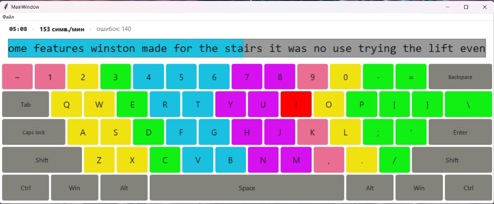
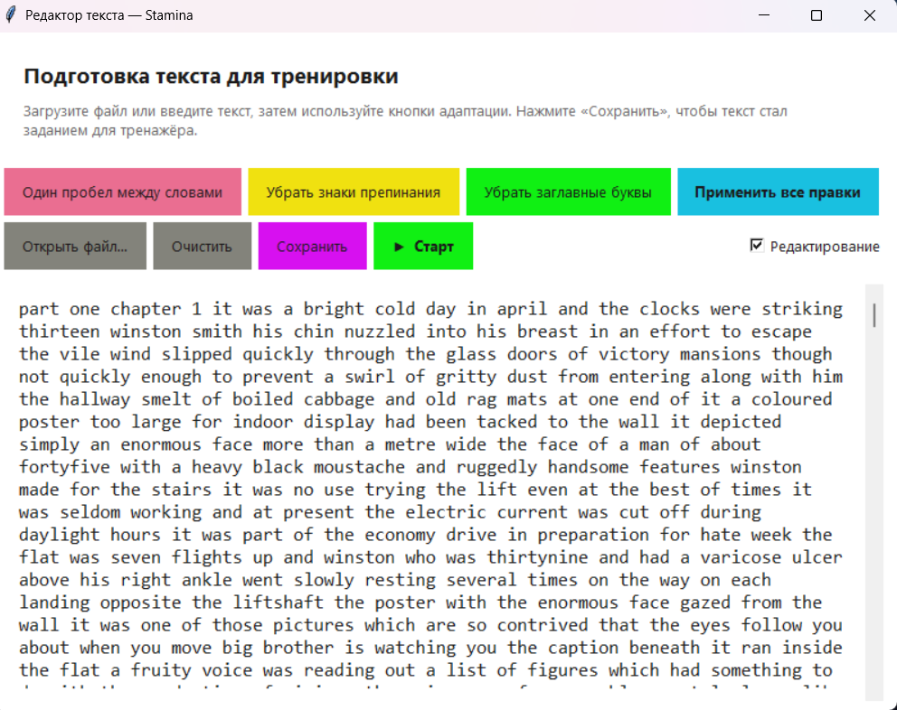

# Stamina — клавиатурный тренажёр (Python + Tkinter)

Stamina — это настольный тренажёр слепой печати. В отличие от классических
тренажёров со случайной последовательностью букв, Stamina работает с
**пользовательским текстом**: вы загружаете книгу/статью, программа её
адаптирует (один пробел между словами, без знаков препинания, нижний
регистр) и предлагает набрать. При наборе текст «проезжает» через
фиксированный центр окна, текущая буква подсвечивается красным на
виртуальной клавиатуре, рядом считается скорость и количество ошибок.

## Скриншоты

### Главное окно


Сверху — статистика (`время · симв./мин · ошибок`).
Под ней — двухцветная полоса набора с **фиксированной границей в центре**:
слева бирюзовый цвет уже набранных символов, справа серый цвет того,
что предстоит. Текущая буква — первая справа от границы — подсвечена
красным на клавиатуре (на скриншоте это клавиша `I`).

### Окно редактора текста


Открывается автоматически при первом запуске или через `Ctrl+E`.
Содержит большое поле для текста, кнопки адаптации и две действия
«Сохранить / Старт».

---

## Главное окно — описание элементов

| Элемент | Назначение |
| --- | --- |
| Заголовок `MainWindow` | Имя окна (имитация WPF-оригинала) |
| Меню `Файл → Редактор текста…` | Открывает окно редактора. Горячая клавиша `Ctrl+E` |
| Меню `Файл → Начать / перезапустить` | Стартует сессию с текущего адаптированного текста. Горячая клавиша `F5` |
| Меню `Файл → Сбросить прогресс` | Перезапускает сессию с нуля |
| Меню `Файл → Выход` | Закрывает программу с подтверждением |
| Строка статистики | `MM:SS · N симв./мин · ошибок: K`, обновляется на каждый ввод и раз в 0.5 с |
| Полоса набора | Цветная: бирюза — набрано, серое — осталось; граница всегда в центре |
| Клавиатура 30×5 | QWERTY без нампада; цвета клавиш = зоны пальцев; текущая буква горит красным |

## Окно редактора — описание кнопок

| Кнопка | Цвет | Что делает |
| --- | --- | --- |
| **Один пробел между словами** | розовый | Заменяет любые пробельные символы (табы, переводы строк, неразрывные пробелы) на ровно один обычный пробел. Убирает крайние пробелы. |
| **Убрать знаки препинания** | жёлтый | Удаляет английские и русские знаки препинания (`.,!?;:` `«»""''` `—–…` и др.). Буквы и цифры сохраняются. |
| **Убрать заглавные буквы** | зелёный | Переводит весь текст в нижний регистр (работает и для кириллицы, включая `Ё → ё`). |
| **Применить все правки** | бирюзовый | Запускает все три правила сразу: пунктуация → нижний регистр → один пробел. |
| **Открыть файл…** | серый | Загрузка `.txt` файла (UTF-8 или cp1251). |
| **Очистить** | серый | Полностью очищает поле текста (с подтверждением). |
| **Сохранить** | пурпурный | Передаёт адаптированный текст в тренажёр и закрывает редактор. Дополнительно предлагает сохранить адаптированный текст в `.txt` на диске. Тренировка **не** стартует автоматически — её можно начать вручную клавишей `F5`. |
| **▶ Старт** | зелёный | То же, что «Сохранить», но сразу же начинает тренировку — главное окно получает фокус, первая буква загорается красным, таймер пошёл. |
| Флажок **Редактирование** | — | Если выключен, поле текста становится «только для чтения», кнопки адаптации блокируются. Полезно, когда подготовленный текст не нужно случайно изменить. |

Снизу — живой **предпросмотр** того, что попадёт в тренажёр (адаптированная
строка + количество символов).

## Горячие клавиши

- **F5** — начать / перезапустить тренировку
- **Ctrl+E** — открыть редактор
- **Esc** — пауза с диалогом «Продолжить упражнение? — Нет = закрыть программу».
  Время и счётчик скорости останавливаются; при «Да» возобновляются с того
  же значения.

## Сохранение сессии

Состояние тренировки (текст, текущий индекс, прошедшее время, число
ошибок) автоматически сохраняется в `~/.stamina/session.json`
(на Windows — `%APPDATA%/Stamina/session.json`). При следующем запуске
программа предложит **«Найдена незавершённая сессия — продолжить?»** и
восстановит набор с того же места, с учётом ранее накопленного времени.

Сессия удаляется при успешном завершении текста и при сохранении нового
текста в редакторе.

## Установка и запуск

Требования: **Python 3.10+** (стандартная библиотека, `tkinter`).
Внешних зависимостей нет — `requirements.txt` пуст.

```powershell
git clone https://github.com/Teslyar75/My_Stamina.git
cd My_Stamina
python main.py
```

Удобные запускалки на Windows:

- `Stamina.bat` — двойной клик; запускает программу без чёрного окна
  консоли (через `pythonw.exe`).
- `create_shortcut.ps1` — создаёт ярлык `Stamina.lnk` на рабочем столе:

  ```powershell
  powershell -ExecutionPolicy Bypass -File create_shortcut.ps1
  ```

## Тесты

```powershell
python -m unittest discover -s tests -v
```

Покрыта вся логика адаптации текста (англ./рус. пунктуация, регистр,
сжатие пробелов, проверка валидности).

## Структура проекта

```
stamina/
  app.py                сборка приложения, диалог «продолжить?», авто-старт
  main_window.py        главное окно: сессия, статистика, обработка нажатий
  keyboard.py           виртуальная клавиатура (сетка 30×5, подсветка)
  keyboard_layout.py    раскладка QWERTY без нампада, цветовые зоны
  widgets.py            RoundedKey, SequencePanel (двухцветная), StatsPanel
  theme.py              цвета, шрифты, геометрия
  text_editor.py        окно редактора с кнопками адаптации
  text_processing.py    нормализация пробелов / пунктуация / регистр
  session_storage.py    сохранение/загрузка сессии в JSON

main.py                 точка входа
Stamina.bat             двойной клик → запуск
create_shortcut.ps1     создаёт ярлык на рабочем столе

tests/
  test_text_processing.py   15 unit-тестов адаптации

docs/screenshots/       скриншоты для README
```

## Технические детали

- UI — `tkinter` без сторонних пакетов; клавиши нарисованы на `Canvas`
  скруглённым полигоном.
- Полоса набора — `Canvas` с моноширинным шрифтом (`Consolas 22`):
  ширина каждого символа одинакова, поэтому граница цветов ровно
  совпадает с границей букв. Окно показа подбирается так, чтобы
  курсор-граница всегда стоял в центре; за пределами текста добавляются
  пробелы, чтобы скроллинг был плавным.
- Сравнение нажатой клавиши и ожидаемой — регистронезависимое.
  Текст всегда нижнего регистра после адаптации, но Caps Lock / Shift
  не ломает тренировку.
- Esc-пауза фиксирует прошедшее время в накопителе `_prior_elapsed`,
  обнуляет «точку отсчёта» и до подтверждения «Продолжить» не считает
  ни время, ни ошибки.
- Сессия пишется атомарно (`*.json.tmp` → `replace`), поэтому при
  неожиданном выключении файл не побьётся.

## Лицензия

MIT (см. `LICENSE` — при необходимости добавьте файл).
