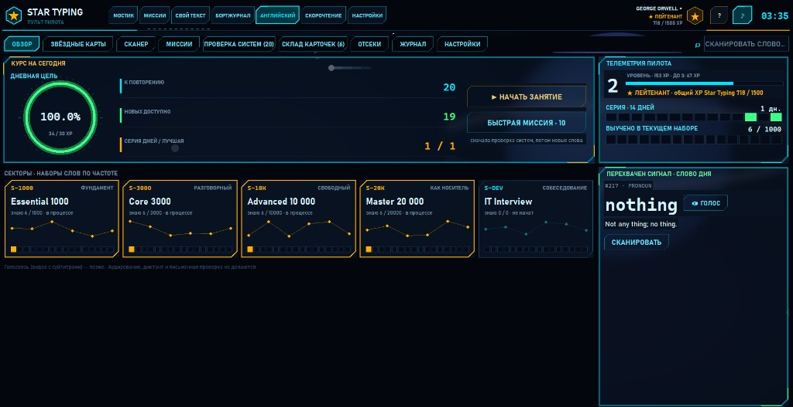
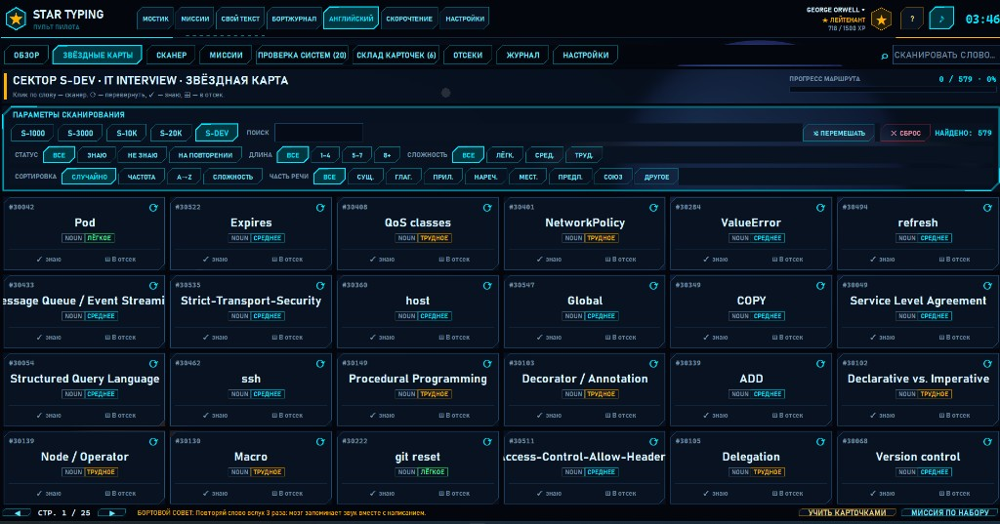

# IT Interview (S-DEV) — английский для собеседований по программированию

Документ описывает обновление вкладки **«АНГЛИЙСКИЙ»** в [Star Typing / My_Stamina](https://github.com/Teslyar75/My_Stamina): тематический набор **IT Interview (S-DEV)**.

Файл в репозитории:  
`https://github.com/Teslyar75/My_Stamina/blob/feature/warehouse-cards/docs/IT_INTERVIEW.md`

---

## Зачем

Чтобы уверенно проходить **coding / IT interviews на английском**, нужен не только общий словарь (S-1000…S-20K), но и термины, которые реально звучат на собеседованиях: API, CI/CD, patterns, git, SQL, Docker, Kubernetes, observability и т. п.

Набор **S-DEV** — отдельный сектор на **ОБЗОРЕ** и кнопка в **Звёздных картах**. Он не входит в частотные top-* по рангу wordfreq: это тематическая подборка.

---

## Скриншоты

### Обзор: сектор S-DEV

На **ОБЗОРЕ** пять секторов: S-1000 … S-20K и **S-DEV · IT Interview · СОБЕСЕДОВАНИЕ**.

### Звёздные карты: набор IT Interview

Фильтр **S-DEV**, найдено **579** терминов. Плитки с ID, сложностью и действиями «знаю» / «в отсек».

---

## Как пользоваться

1. Вкладка **Английский** → **Звёздные карты** → кнопка **S-DEV** (или в **Настройках** → текущий набор).
2. Учите слова в **Сканере**, говорите в микрофон, затем гоняйте их на **Складе карточек** (RU → EN вслух).
3. Миссии и «слово дня» тоже берутся из выбранного набора.

В наборе: glossary, paradigms, design patterns, git, SQL, Docker/K8s, observability и др. Источник — [CodersLingo](https://coderslingo.com/glossary/) (CC BY 4.0).

Рекомендуемый цикл на день (20–30 мин) с этим набором:

1. Переключить текущий набор на **S-DEV**.
2. 5–10 новых терминов в **Сканере** (🔊 / 🐢, определение, пример, произношение).
3. Миссия «Говорение» или «Случайная» по набору.
4. Закрепить на **Складе карточек** (см. [WAREHOUSE_CARDS.md](WAREHOUSE_CARDS.md)).

---

## Что внутри

| | |
| --- | --- |
| Идентификатор набора | `dev-interview` (код UI: **S-DEV**) |
| Файл словаря | `stamina/english/data/vocab_dev.json` |
| Объём | ~580 терминов |
| Slug слов | префикс `dev:` (не пересекается с общим `vocab.json`) |
| Ранги | от 30001 (после Master 20k) |
| Сборка | `python scripts/build_dev_vocab.py` |

Категории (ориентировочно): core-glossary, paradigms, design-patterns, git-commands, sql, error-types, observability, http-status-codes, docker, kubernetes, cloud-services, cli-commands, terraform, http-headers, regex-flags, cli-flags.

У каждого термина: английское определение, русский перевод (для лица карточки), 2–3 предложения-примера (в т. ч. в стиле «объясни на интервью»).

---

## Технически

- `stamina/english/vocab.py` — набор в `SETS`, выборка через `THEMATIC_SETS` / поле `sets[]`, при загрузке подмешивается `vocab_dev.json`.
- Частотные наборы top-* **не** включают IT-слова с rank > 20 000.
- Кэш сырого датасета и MT-переводов (`_coderslingo_raw.json`, `_dev_ru_cache.json`) в git не коммитится (см. `stamina/english/data/.gitignore`).

Подробнее о формате словаря: [ENGLISH_DATA.md](ENGLISH_DATA.md). Устройство вкладки: [ENGLISH_TAB.md](ENGLISH_TAB.md).

---

## Лицензия данных

Термины и определения взяты из открытого датасета **CodersLingo** ([coderslingo.com/glossary](https://coderslingo.com/glossary/)), лицензия **CC BY 4.0**.  
Адаптация для Star Typing: структура записи, `slug`, предложения для тренировки, русские подписи карточек. При распространении `vocab_dev.json` указывайте CodersLingo.
