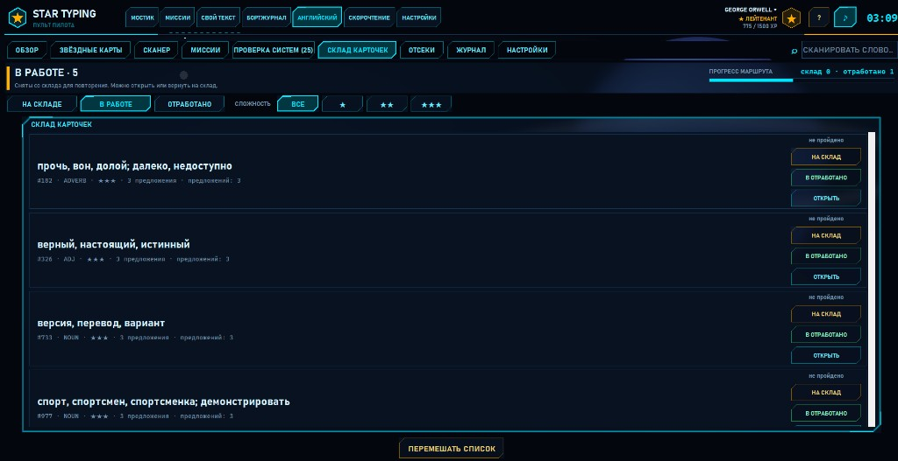
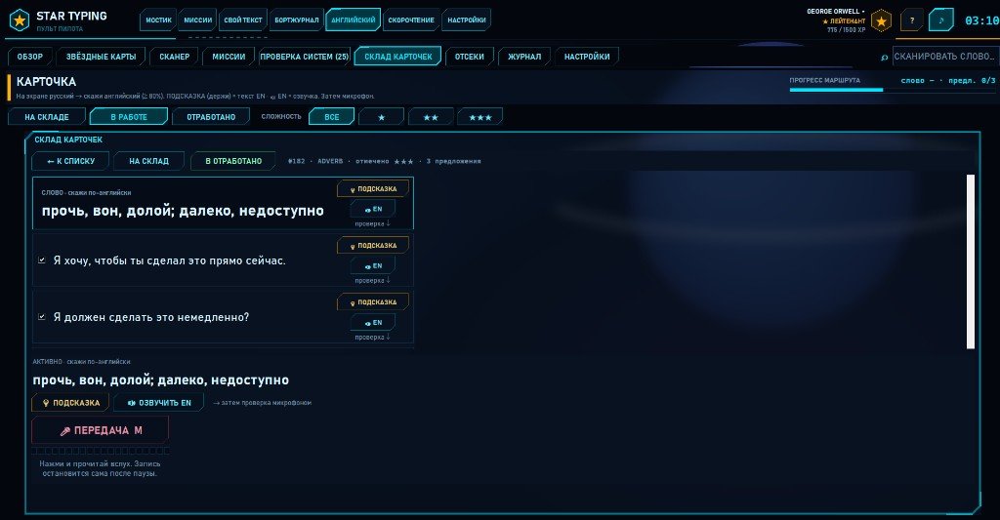
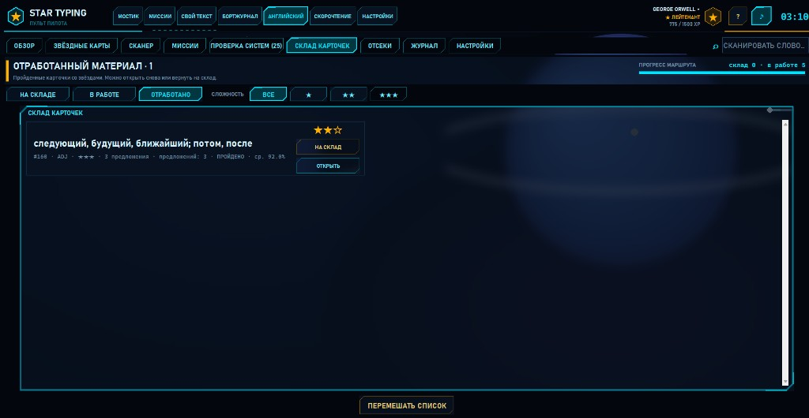

# Склад карточек — упражнение на перевод вслух

Документ описывает обновление вкладки **«АНГЛИЙСКИЙ»** в [Star Typing / My_Stamina](https://github.com/Teslyar75/My_Stamina): подраздел **СКЛАД КАРТОЧЕК**.

Его можно пересылать отдельно: файл лежит в репозитории  
`https://github.com/Teslyar75/My_Stamina/blob/master/docs/WAREHOUSE_CARDS.md`  
(после слияния в `master`; на ветке разработки — тот же путь в `feature/warehouse-cards`).

---

## Зачем это упражнение

После того как слово уже **известно** или **выучено**, его полезно закрепить иначе: видеть **русский** текст и **сказать английский** вслух — и для самого слова, и для примеров.

Склад — это не интервальные флеш-карточки и не миссии «с листа», а отдельный отсек:

1. выбираешь карточку из списка;
2. переводишь вслух русский → английский;
3. получаешь звёзды за качество;
4. убираешь карточку в **отработанный материал** (автоматически или вручную).

---

## Скриншоты

### Список «В РАБОТЕ»

Список карточек, снятых со склада для повторения. У каждой — **НА СКЛАД**, **В ОТРАБОТАНО**, **ОТКРЫТЬ**. Сверху переключатель отсеков: НА СКЛАДЕ · В РАБОТЕ · ОТРАБОТАНО.

### Открытая карточка

На экране русский текст слова и предложений. **ПОДСКАЗКА** (удерживай — английский), **🔊 EN** / **ОЗВУЧИТЬ EN**, затем микрофон **ПЕРЕДАЧА**. В шапке — **В ОТРАБОТАНО**.

### Отсек «Отработанный материал»

Пройденные карточки со звёздами и средней точностью. Можно снова **ОТКРЫТЬ** или вернуть **НА СКЛАД**.

---

## Как слово попадает на склад

Карточка появляется в отсеке **НА СКЛАДЕ**, если:

- слово отмечено **«ЗНАЮ»** или выучено по SM-2 (интервал ≥ 21 день);
- у слова есть хотя бы одно примерное предложение в словаре;
- слово **не** снято в «В РАБОТЕ» и **не** лежит уже в «ОТРАБОТАНО».

Отдельно «добавлять на склад» не нужно — достаточно выучить слово в СКАНЕРЕ / ПРОВЕРКЕ СИСТЕМ.

---

## Три отсека

| Отсек | Что внутри |
| --- | --- |
| **НА СКЛАДЕ** | Активные карточки для упражнения |
| **В РАБОТЕ** | Сняты со склада кнопкой **В РАБОТУ** — снова в обычный цикл (в т.ч. проверка систем) |
| **ОТРАБОТАНО** | Пройденные или вручную отправленные карточки со звёздами |

Из **ОТРАБОТАНО** можно вернуть карточку **НА СКЛАД** (прохождение сбрасывается, можно пройти снова).

---

## Как устроена карточка

### На экране — русский

- строка **слова** — русский перевод (его нужно сказать по-английски);
- ниже — **примеры предложений** на русском (то же: переводишь вслух на английский).

### Галочки (сложность)

Напротив каждого предложения — галочка. Сколько отмечено — такая сложность прогона (★ / ★★ / ★★★ по числу примеров). Хотя бы одно предложение должно быть отмечено.

### Подсказка и озвучка

| Кнопка | Действие |
| --- | --- |
| **💡 ПОДСКАЗКА** | **Удерживай** — вместо русского на мгновение показывается английский текст; **отпустил** — снова русский |
| **🔊 EN** / **ОЗВУЧИТЬ EN** | Голос Windows произносит **английский** образец (не русский текст) |

Русский специально **не** озвучивается: его нужно прочитать глазами и перевести самому.

### Проверка микрофоном

1. Выбери активную строку (слово или предложение).
2. Нажми **🎤 ПЕРЕДАЧА** (или **M**) и скажи английский вариант.
3. Нужно совпадение **≥ 80 %** (Vosk, без интернета). Есть самооценка, если распознавание недоступно.

Сначала обычно закрывают **слово**, затем отмеченные **предложения**.

---

## Звёзды и статус «пройдено»

Когда **слово** и **все отмеченные предложения** набраны ≥ 80 %:

- считается **средняя точность** по этим частям;
- выставляются звёзды (как в миссиях):

| Звёзды | Средняя точность |
| --- | --- |
| ★ | ≥ 60 % |
| ★★ | ≥ 80 % |
| ★★★ | ≥ 95 % |

- карточка получает статус **пройдена** и переносится в отсек **ОТРАБОТАНО**;
- за новые звёзды начисляется небольшой бонус XP.

В списке у пройденных карточек видны глифы ★☆☆ / ★★☆ / ★★★ и средняя точность.

---

## Кнопка «В ОТРАБОТАНО»

Можно **не ждать** автозачёта и отправить карточку вручную:

- в списке **НА СКЛАДЕ** / **В РАБОТЕ** → **В ОТРАБОТАНО**;
- или та же кнопка в шапке открытой карточки.

Звёзды считаются по уже сохранённым лучшим баллам; если замеров ещё нет — ставится ★★ (ручной перенос «хорошо проработанной» карточки).

Так удобно архивировать материал, который уже уверенно отработан, и не держать его в активном списке.

---

## Клавиши (на карточке)

| Клавиша | Действие |
| --- | --- |
| **M** | микрофон |
| **Esc** / Backspace | к списку |
| ← → (в режиме списка — через кнопки) | соседние карточки / выход |

При каждом заходе на вкладку **СКЛАД КАРТОЧЕК** снова открывается **список**, а не незакрытая карточка — можно выбрать любую.

---

## Где в коде

| Файл | Роль |
| --- | --- |
| `stamina/english/warehouse.py` | сбор карточек, отсеки, звёзды, архив |
| `stamina/english/pages_warehouse.py` | UI: список, карточка, подсказка-удержание, микрофон |
| `stamina/english/screen.py` | пункт меню **СКЛАД КАРТОЧЕК** |
| Прогресс | `%APPDATA%\Stamina\english.json` → блок `warehouse` (`sel`, `away`, `cleared`, `best`, …) |

Пользовательская глава в инструкции: [ИНСТРУКЦИЯ.md](../ИНСТРУКЦИЯ.md) §12, строка про **СКЛАД КАРТОЧЕК**.

---

## Короткий сценарий «с нуля»

1. В **СКАНЕРЕ** отметь слово **✓ ЗНАЮ**, при желании проговори примеры в канале связи.
2. Открой **СКЛАД КАРТОЧЕК** → карточка в **НА СКЛАДЕ**.
3. Отметь нужные предложения галочками.
4. Скажи по-английски слово, затем предложения (подсказку держи, **🔊 EN** — если нужен образец).
5. При ≥ 80 % на всём отмеченном — звёзды и перенос в **ОТРАБОТАНО**  
   *или* сразу нажми **В ОТРАБОТАНО**.
6. Позже можно вернуть карточку **НА СКЛАД** и пройти снова.

---

*Star Typing · вкладка «АНГЛИЙСКИЙ» · склад карточек*
